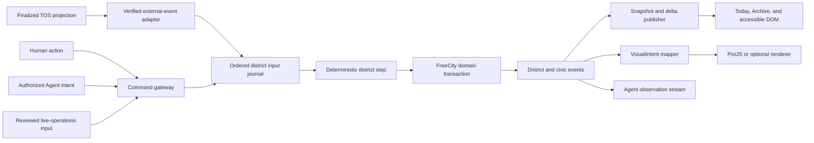

# FreeCity District Simulation Runtime

**Document version:** 1.0<br>
**Last updated:** 2026-08-16<br>
**Document role:** Normative architecture for authoritative district gameplay, ordered commands, deterministic consequences, offline progression, synchronization, replay, and rendering boundaries<br>
**Companion documents:** [Vision and Architecture](FREECITY_VISION_AND_ARCHITECTURE.md), [Playable Experience V1](FREECITY_PLAYABLE_EXPERIENCE_V1.md), [District Zero First Cohort Playbook](FREECITY_DISTRICT_ZERO_FIRST_COHORT_PLAYBOOK.md), and [TOS Dual-Currency Infrastructure](FREECITY_TOS_DUAL_CURRENCY_INFRASTRUCTURE.md)<br>
**Normative protocol reference:** [TOS Service FreeCity Application Profile](https://github.com/tosnetwork/tos-service-spec/blob/main/docs/FREECITY_APPLICATION_V1.md)

## Status and Evidence Rule

This document is an implementation decision and acceptance specification. It is not evidence that the runtime, its scale targets, or its framework integrations have been implemented or validated.

Every implementation claim must be labelled as one of:

- **design target**;
- **prototype evidence**;
- **cohort evidence**; or
- **production evidence**.

The repository is currently at the design-target stage.

---

## Executive Decision

FreeCity should use a **server-authoritative, event-driven District Simulation Runtime** for its persistent gameplay.

The runtime is not a continuous 60 Hz MMO server and does not simulate an imaginary population. It processes attributable human, Agent, live-operations, FreeCity, and finalized TOS inputs in a stable order; advances bounded gameplay state; records durable consequences; and publishes replayable district events. Most district work happens when an input arrives or a scheduled consequence becomes due. Inactive districts may sleep.

The browser may still render motion at up to 60 frames per second. PixiJS interpolates semantic state and visualizes events; it does not decide whether Focus was spent, a contribution counted, a relationship changed, a ballot was accepted, or a payment finalized.

The recommended stack is:

```text
Next.js + React application shell
  + fixed civic and economic interfaces
  + accessible DOM representation
  + PixiJS district renderer
  + Phaser only for bounded minigames that need game-engine features
  + optional R3F or PlayCanvas 3D experiences after the 2D product works

FreeCity District Simulation Runtime
  + ordered and idempotent command intake
  + event-driven deterministic steps
  + scheduled and capped offline progression
  + snapshots, replay, correction, and audit
  + district events and compact state deltas
  + Colyseus only for opt-in synchronous rooms

Persistent and external authorities
  + PostgreSQL for durable FreeCity state, commands, events, and snapshots
  + Redis for rebuildable presence, queues, locks, and hot caches
  + OpenFox and tos-ai for asynchronous Agent planning and execution
  + TOS Network and TOS Service for canonical protocol and economic facts
```

The most important design rule is:

> **One visible city, multiple explicit authorities, and no accidental second truth.**

---

## 1. Why This Runtime Exists

FreeCity fails as a product if it is only a dashboard whose numbers and map markers change occasionally. It also fails as a trustworthy society if visual animation, a language model, or a game room can invent durable social or economic facts.

The District Simulation Runtime connects these needs. It makes the city mechanically alive by owning bounded gameplay state such as:

- daily Focus consumption and refresh;
- Decision Card acceptance, expiry, and supersession;
- delayed Consequences and return cues;
- relationship and repair episode stages;
- Circle and shared-project gameplay stages;
- District Beacon contributions and path progress;
- season time, ceremonies, and authored district developments;
- progression records and artifact unlock conditions; and
- non-monetary rehearsals of bounded civic play.

It does **not** own:

- canonical TOS Agent identity or control;
- Capability, Accepted Quote, escrow, Receipt, or settlement truth;
- private Agent memory or general Agent reasoning;
- wallet balances, a FreeCity token, or an application balance;
- final civic records that belong to reviewed FreeCity domain services;
- arbitrary generated stories presented as real residents or activity; or
- the client animation clock.

The runtime references durable domain objects instead of copying the whole social database into a game world.

---

## 2. Lessons from Successful Browser Worlds

The architecture decision is based on product behavior rather than engine fashion.

[Forge of Empires](https://www.innogames.com/games/forge-of-empires/) demonstrates the durability of persistent progression, offline production, social groups, scheduled events, and cross-device continuity. [RuneScape](https://www.runescape.com/community) demonstrates the long-term value of persistent identity, a shared economy, skills, social history, and a world that continues beyond a single session. Their lesson for FreeCity is not to copy combat, construction, or a particular renderer. It is to make returning meaningful.

FreeCity should adopt these structural lessons:

1. **Persistence before spectacle.** A resident returns to inspect consequences and relationships, not merely animation.
2. **Useful activity while away.** Time can resolve authorized work and scheduled developments without impersonating a human or Agent.
3. **Short return loop, long mastery loop.** A thirty-second summary and five-minute decision should feed relationships, craft, place, and civic history across seasons.
4. **Social dependency.** Circles, complementary roles, and shared goals must matter mechanically.
5. **Live operations as authored system input.** Events need reviewed templates, schedules, versioning, and rollback—not ad hoc database edits.
6. **Cross-device continuity.** The authoritative state belongs on the server; the browser is a responsive projection and command client.
7. **Engine independence.** Product state must survive a renderer or room-server replacement.

These are design hypotheses until District Zero produces cohort evidence.

---

## 3. Authority Model

### 3.1 Authority Classes

| Authority | Owns | Example | Must not do |
| --- | --- | --- | --- |
| **TOS Network and TOS Service** | Canonical Agent, Capability, Quote, escrow, Receipt, asset, and settlement facts | Stablecoin escrow release finalized | Accept a FreeCity animation as settlement evidence |
| **FreeCity domain services** | Durable local social and civic records | Relationship invitation committed; Steward ballot accepted | Recreate TOS protocol truth |
| **District Simulation Runtime** | Bounded game mechanics and their causal order | Focus spent; card chosen; Beacon path advanced | Mint balances, finalize votes, or invent social actors |
| **OpenFox and `tos-ai`** | Agent planning, tools, schedules, execution, and proposed intents | Agent proposes an introduction or drafts an artifact | Mutate runtime, civic, or TOS state without an authorized command |
| **Live City Projection** | Rebuildable spatial and animated presentation | A contribution lights the Beacon | Turn animation completion into a fact |
| **Client UI and renderer** | Input capture, local prediction where allowed, interpolation, accessibility, and presentation | Smooth resident movement at 60 FPS | Commit authoritative consequences locally |

### 3.2 End-to-End Flow



The runtime may call a FreeCity domain service within one reviewed transaction boundary or emit a domain command for that service. The boundary must be explicit for every command type. An external event enters the runtime only through a verified adapter and never by trusting client-supplied authority labels.

---

## 4. Runtime Model

### 4.1 Unit of Partitioning

The primary runtime partition is a `DistrictRuntime` identified by a stable `district_id` and `season_id`.

Each partition owns only the active gameplay view of:

- residents participating in that district and season;
- referenced places, Circles, projects, episodes, and Beacon paths;
- active cards, choices, consequences, timers, and local progression;
- monotonic input and event sequences; and
- the latest accepted snapshot version.

Identity, profile, private conversation, Agent memory, organization, wallet, and TOS records remain in their source systems. Runtime objects store typed references and the minimum denormalized fields needed for deterministic validation.

### 4.2 Recommended Execution Model

District Zero should use an **event-driven actor per active district**, backed by PostgreSQL:

1. wake when a command, verified external event, or scheduled deadline is ready;
2. acquire one lease for the district partition;
3. read the last committed runtime version and pending ordered inputs;
4. apply a bounded deterministic step;
5. commit state changes, output events, and the new sequence atomically;
6. publish rebuildable deltas after commit; and
7. sleep when no immediate work remains.

A fixed high-frequency server tick is unnecessary for the first product. It would add cost and coordination complexity without improving a daily social-strategy loop.

### 4.3 Time Domains

FreeCity must distinguish:

| Time | Meaning | Authority |
| --- | --- | --- |
| `received_at` | When the command gateway durably received an input | Server clock |
| `district_sequence` | Total order within one district partition | Runtime transaction |
| `effective_at` | When an accepted gameplay effect becomes applicable | Runtime rule and server time |
| `observed_at` | When FreeCity observed an external status | Adapter clock |
| `tos_finalized_at` | Finality time resolved from TOS | TOS resolver |
| client timestamp | UX and latency hint only | Never used alone for ordering or expiry |

No rule may read the wall clock directly inside deterministic logic. The step receives an explicit `step_time` chosen and recorded by the scheduler.

### 4.4 Initial Code and Deployment Shape

District Zero should keep one TypeScript monorepo and deploy a small number of explicit process types:

```text
apps/web
  Next.js, React, fixed product UI, accessible DOM, PixiJS adapter

services/application-api
  authentication, command gateway, queries, operator API

workers/district-runtime
  leases, ordered input consumption, deterministic steps, schedules, outbox

workers/integration
  TOS resolver adapter, OpenFox and tos-ai adapter, notifications, projections

packages/contracts
  versioned commands, events, snapshots, deltas, authority and privacy types

packages/district-rules
  pure deterministic state machines and replay fixtures

packages/client-world
  semantic client state, reconciliation, accessible summaries, renderer adapter
```

The application API and integration workers may begin in one deployable Node.js service if their module and queue boundaries remain explicit. The District Runtime worker should remain a separate long-running process because it owns leases, scheduled wakeups, and bounded work loops; it must not depend on a short-lived Next.js request or serverless function remaining active.

The first deployment should use one primary region, managed PostgreSQL with point-in-time recovery, rebuildable Redis, object storage and CDN, the Next.js web application, an application/event gateway, and at least two runtime-worker instances for failover. Multi-region writes are deferred until measured availability or latency requires them. This is a modular-monolith start with replaceable processes, not an early microservice program.

---

## 5. Input and Command Contract

Every state-changing gameplay request uses a versioned envelope:

```ts
type DistrictCommandEnvelope = {
  commandId: string;
  idempotencyKey: string;
  commandType: string;
  schemaVersion: number;
  districtId: string;
  seasonId: string;
  actorRef: string;
  actorAuthority: "human" | "agent" | "operator" | "system" | "tos_adapter";
  sourceRef: string;
  expectedRuntimeVersion?: number;
  clientObservedAt?: string;
  serverReceivedAt: string;
  correlationId: string;
  causationId?: string;
  privacyScope: string;
  payload: unknown;
};
```

Required command behavior:

- `commandId` is globally unique and immutable;
- `idempotencyKey` is scoped to the authority, operation, and intended effect;
- the authenticated principal is derived at the gateway, not accepted from the payload;
- authorization is evaluated against the current policy and object version;
- the accepted command receives exactly one `district_sequence`;
- duplicate delivery returns the original result;
- stale optimistic commands receive an explicit conflict and current version;
- ambiguous external submission is resolved before retry; and
- secrets, private messages, raw memories, and unnecessary model prompts are excluded.

Command lifecycle states are:

```text
received -> validated -> accepted -> applied
                  \-> rejected
       accepted -> superseded or cancelled by an explicit rule
```

The original result remains queryable by `commandId`.

---

## 6. Deterministic Step Semantics

A runtime step is deterministic when the same runtime version, ordered inputs, ruleset version, explicit time, and random seed produce the same output state and events.

The step must obey these rules:

1. Inputs are processed by committed `district_sequence`, never arrival order in Redis or a WebSocket.
2. Rules are pinned by `ruleset_version` for the season or migrated by an explicit event.
3. Randomness uses a recorded deterministic seed and named draw stream.
4. Floating-point values are avoided for ledgers, counters, scoring, and eligibility.
5. Language models, network calls, system time, browser state, and unversioned configuration never run inside the step.
6. Every effect has a stable causal input and output event identifier.
7. A step has limits on inputs, scheduled effects, output events, and execution time.
8. Failure commits nothing; retry starts from the same durable version.
9. Operator correction is a new attributable command or compensating event, not history deletion.
10. A completed animation, notification delivery, or Agent message cannot acknowledge a state transition on behalf of the runtime.

The first implementation should favor explicit state machines over a general-purpose physics or entity-component system. A narrow rules package is easier to audit and replay.

---

## 7. Scheduled and Offline Progression

FreeCity should feel active while the resident is away without pretending that unauthorized decisions occurred.

### 7.1 Allowed Offline Effects

- a previously accepted consequence reaches its due state;
- Focus refreshes under a published rule;
- an authored season or ceremony window opens or closes;
- a project deadline passes;
- an Agent completes a previously authorized bounded task and submits a proposal or artifact;
- an external TOS lifecycle event finalizes and is projected; or
- a relationship or district thread becomes ready for the next human decision.

### 7.2 Disallowed Offline Effects

- spending money or TOS without the applicable authority;
- casting a ballot, changing privacy, or accepting a relationship for the resident;
- fabricating dialogue or work as a durable fact;
- creating fake neighbors, crowds, demand, scarcity, or transactions;
- silently changing an expired choice into a different choice; or
- running unbounded catch-up proportional to every missed second.

### 7.3 Catch-Up Algorithm

On wake or return:

1. load the latest snapshot and events after it;
2. determine the recorded `step_time` and due scheduled effects;
3. process due effects in stable deadline and identifier order;
4. stop at configured work and event limits;
5. schedule another continuation if work remains;
6. publish one factual **While You Were Away** summary from committed output events; and
7. never block the resident from inspecting the last trusted state.

The summary is generated after state commitment. Optional language generation may improve wording but must cite the underlying event IDs and pass final validation.

---

## 8. Persistence, Snapshots, and Replay

### 8.1 Durable PostgreSQL Records

The minimum durable records are:

- `district_runtime` with current version, ruleset, step time, and status;
- `district_command` with envelope, result, sequence, and authority decision;
- `district_event` with causal references, authority class, schema, and privacy scope;
- `scheduled_effect` with due time, stable key, rule version, and state;
- `district_snapshot` with version, checksum, schema, and creation reason;
- `district_correction` referencing the original error and operator authority; and
- `projection_checkpoint` for rebuildable consumers.

Append-only command and event records are preferred. Personally sensitive payloads that require erasure should be referenced through a redactable data object rather than copied into the immutable journal.

### 8.2 Redis Boundary

Redis may hold:

- district leases;
- ready queues;
- presence and connection routing;
- transient rate limits;
- recent delta cache; and
- publish/subscribe notifications.

Loss of Redis may reduce liveness but must not erase a committed command, consequence, or recovery path. All Redis state must be rebuildable from PostgreSQL or active connections.

### 8.3 Snapshot Policy

Create a snapshot:

- after a bounded number of committed events;
- before and after a ruleset migration;
- at a season milestone;
- before a high-risk live operation; and
- during graceful district suspension.

Every snapshot includes a deterministic checksum. A replay job rebuilds from an earlier snapshot and compares the resulting checksum and event stream. Divergence is a release blocker.

---

## 9. Client Synchronization and Rendering

### 9.1 Persistent Asynchronous City Path

The default path uses WebSocket or Server-Sent Events for ordered district events and compact state deltas. A reconnecting client sends its last acknowledged district version and projection checkpoint, then receives either:

- missing deltas;
- a current snapshot plus later deltas; or
- an explicit reset when its schema is unsupported.

The client maintains:

- one semantic district state;
- a synchronized DOM and accessible activity representation;
- renderer-specific interpolation state; and
- pending-command UI keyed by `commandId`.

Local prediction may improve non-consequential motion. A predicted Focus spend, choice, contribution, ballot, payment, or relationship change must remain visibly pending until its authoritative result arrives.

### 9.2 PixiJS Boundary

[PixiJS](https://github.com/pixijs/pixijs) is the preferred 2D renderer behind a FreeCity-owned adapter. It owns sprites, layers, particles, semantic movement, camera transitions, and visual interpolation. It consumes semantic projection objects and `VisualIntent`; it does not import repositories, issue domain writes, or define gameplay truth.

The same semantic state must support:

- reduced motion;
- keyboard navigation;
- screen-reader descriptions;
- a synchronized list or structured view;
- responsive mobile presentation; and
- a non-Canvas fallback for every cohort-critical action.

### 9.3 Synchronous Room Path

[Colyseus](https://github.com/colyseus/colyseus) should be introduced only for an opt-in `RealtimeRoom` that genuinely needs low-latency shared state, such as a workshop, performance, or bounded minigame.

A room:

- authenticates through FreeCity;
- receives a narrow capability and district context;
- owns only ephemeral room state and explicitly listed room outcomes;
- submits a signed, idempotent outcome command to the District Runtime;
- cannot write Postgres domain tables directly;
- cannot decide payment, identity, governance, or final social records; and
- may fail without corrupting the persistent district.

Colyseus is therefore a room synchronization tool, not FreeCity's application authority.

---

## 10. Agent Integration

OpenFox and `tos-ai` remain outside the deterministic step.

The Agent path is:

```text
committed district event or authorized schedule
  -> filtered Agent observation
  -> OpenFox or tos-ai plan and tool execution
  -> proposed Agent intent or bounded result
  -> schema, capability, policy, budget, privacy, and freshness validation
  -> District command or applicable TOS workflow
  -> authoritative result event
```

Every Agent intent includes:

- canonical Agent reference and controller policy reference;
- source observation and causation IDs;
- requested command type and scope;
- capability and budget evidence where applicable;
- expiry and replay protection;
- whether human approval is required; and
- a bounded natural-language explanation separate from the machine command.

Model timeout, invalid output, unavailable tools, or failed generation results in no command. The runtime continues using authored content and explicit degraded states.

Agent memory may influence a proposal but is not copied into public district state. A fact derived from memory must have an independently permitted source before it becomes visible to other residents.

---

## 11. Framework Decisions

| Framework or pattern | Decision | Boundary |
| --- | --- | --- |
| **Next.js + React** | **Adopt** | Application shell, authored product UI, route and data composition, fixed civic/economic flows |
| **PixiJS** | **Adopt behind an adapter** | Default entity-heavy 2D City View; never domain authority |
| **AI Town** | **Reference patterns, do not depend on its whole stack** | Ordered inputs, game-step separation, snapshots, async Agent work, spatial projection |
| **Colyseus** | **Add only when a synchronous room is proven necessary** | Low-latency room synchronization; outcomes return through the runtime |
| **Phaser** | **Optional module** | Bounded tilemap, collision, physics, camera, or minigame needs; not the application shell |
| **React Three Fiber or PlayCanvas** | **Defer and isolate** | Optional 3D district or artifact experience after 2D cohort gates pass |
| **Convex** | **Do not adopt as core authority** | AI Town dependency would overlap with PostgreSQL, event journal, and FreeCity services |
| **Nakama** | **Do not adopt as core authority** | Broad backend features overlap with identity, storage, social, and runtime layers; reassess only for a proven isolated need |
| **RPG-JS** | **Do not adopt for the main product** | Its RPG assumptions do not match FreeCity's social-strategy and civic domain |

[Phaser](https://github.com/phaserjs/phaser), [PlayCanvas Engine](https://github.com/playcanvas/engine), [Nakama](https://github.com/heroiclabs/nakama), and [RPG-JS](https://github.com/RSamaium/RPG-JS) remain useful open-source references. Their presence on GitHub is not by itself a reason to add a production dependency.

The rule for adding an engine is:

> Add the smallest replaceable engine that solves a measured interaction problem; do not give it authority already owned by FreeCity or TOS.

---

## 12. Performance and Scale Targets

These are initial design targets, not benchmark evidence.

| Target | District Zero design target |
| --- | --- |
| Command receipt acknowledgment | p95 under 300 ms in the primary launch region |
| Ordinary command commit | p95 under 1 second, excluding external TOS or Agent work |
| Event-to-client delta | p95 under 1 second for connected clients |
| TOS event projection | Visible after resolver-confirmed finality, with no optimistic settlement label |
| Active district step | p95 under 100 ms for an ordinary bounded batch |
| Reconnect | Current trusted state visible within 3 seconds on an ordinary connection |
| Initial 2D interaction | Responsive before optional ambience or non-critical assets finish |
| Client render | 60 FPS on capable devices, adaptive degradation before loss of meaning |
| Offline catch-up | First useful summary within 3 seconds; continuation may complete in bounded batches |
| Replay | Deterministic checksum match for every release fixture |

Scale by:

- partitioning by district and season;
- waking inactive partitions only for inputs and due effects;
- using interest-based client subscriptions;
- keeping delta schemas compact and versioned;
- treating public city aggregation as a projection, not a global simulation lock;
- moving slow Agent, media, analytics, and TOS work outside runtime transactions; and
- introducing synchronous rooms only for measured concurrency needs.

Do not shard District Zero before instrumentation identifies a bottleneck.

---

## 13. Security, Integrity, and Privacy

The runtime requires:

- server-derived identity and authority;
- per-command schema, permission, rate, budget, and object-version checks;
- replay protection and idempotency;
- allowlisted operator commands with named human accountability;
- signed and verified external adapters;
- strict privacy classification before event publication;
- no prompt or generated text interpreted as an executable command;
- safe limits for input size, scheduled effects, fan-out, and generated artifacts;
- tamper-evident audit references for correction and migration;
- isolation between cohort, testnet, staging, and production environments; and
- an emergency path to suspend a district, Agent, command type, room, or projection without deleting history.

Cheat resistance focuses on server authority, not on hiding client code. A modified client can request an action but cannot decide its authoritative result.

---

## 14. Failure and Recovery

| Failure | Required behavior |
| --- | --- |
| Runtime worker crashes before commit | Lease expires; another worker retries the same durable inputs |
| Worker crashes after commit and before publish | Outbox or checkpoint republishes the committed events |
| Redis is unavailable | Stop or degrade live delivery; retain durable command and state truth in PostgreSQL |
| Replay checksum diverges | Block release or district resume; investigate ruleset, time, random, or migration nondeterminism |
| Agent runtime or model fails | Use authored cards, preserve pending authorized work, and show explicit degraded status |
| TOS resolver is delayed | Keep exact pending or unknown status; never guess finality |
| PixiJS fails | Continue through synchronized DOM/list and fixed command UI |
| Colyseus room fails | Close or reconnect the room; accept only an outcome already committed by the District Runtime |
| A bad live-operations event commits | Add an attributable compensating event and resident-facing correction; do not rewrite the journal silently |
| Catch-up exceeds limits | Commit bounded progress, expose truthful partial status, and queue continuation |

Backups, point-in-time recovery, snapshot restore, and full projection rebuild must be exercised before an external cohort.

---

## 15. Observability

Minimum runtime telemetry includes:

- received, rejected, duplicate, conflict, applied, and failed commands by type and authority;
- command queue age and depth per district;
- step count, duration, input batch, output event count, and failure reason;
- scheduled-effect lateness and offline catch-up batches;
- snapshot age, size, checksum, restore time, and replay divergence;
- database transaction, outbox, lease, and Redis health;
- event-to-delta and event-to-`VisualIntent` latency;
- client acknowledgment lag, reconnect reason, reset rate, and delta size;
- Agent-intent validity, expiry, approval, rejection, and duplicate rate;
- Colyseus room count, outcome submissions, and failed handoffs when enabled; and
- factual correction, privacy suppression, and accessibility fallback usage.

Operations must be able to inspect one causal chain from command through consequence, domain event, snapshot, projection, and client acknowledgment without reading private message or memory contents.

---

## 16. Implementation Plan

### Phase R0: Deterministic Core

- define versioned command, event, snapshot, and scheduled-effect schemas;
- implement one district lease and ordered PostgreSQL input journal;
- implement deterministic step runner with explicit time and random seed;
- add idempotency, optimistic version checks, transactional outbox, and replay fixtures;
- implement Focus, Decision Card, Choice, Consequence, and Beacon state machines;
- publish compact snapshot and delta contracts; and
- provide a CLI or internal tool to replay and compare checksums.

### Phase R1: District Zero Integration

- connect Today, District, Archive, and accessible DOM to runtime state;
- connect PixiJS through a semantic renderer adapter;
- move Event Compiler output into validated card-proposal inputs;
- connect OpenFox and `tos-ai` through authorized Agent intents;
- integrate Circle, relationship episode, progression, and season schedules;
- consume verified FreeCity and TOS events without duplicating their authority;
- add authored degraded mode, correction, suspension, and operator console; and
- pass the forty-eight-hour internal compressed-season dry run.

### Phase R2: Cohort Hardening

- exercise failover, restore, replay, duplicate, conflict, catch-up, and migration tests;
- validate privacy filters, accessibility parity, and mobile reconnection;
- tune district and client budgets from measurements;
- add release fixtures for every P0 gameplay command; and
- freeze the District Zero ruleset except for reviewed migrations and corrections.

### Phase R3: Optional Synchronous Experiences

- add one Colyseus room only after a written interaction need and failure boundary exist;
- add Phaser only if a reviewed minigame needs its tilemap, collision, camera, or physics systems;
- submit room outcomes through the same runtime command contract; and
- measure whether the experience improves retention, collaboration, or creation.

### Phase R4: Optional 3D and Open Extensions

- evaluate R3F or PlayCanvas behind the renderer adapter;
- publish a narrow City Protocol gameplay extension schema;
- sandbox third-party code and require explicit capabilities; and
- preserve server authority, accessible parity, and projection rebuildability.

---

## 17. Acceptance Gates

No external District Zero cohort may launch until:

- [ ] replaying every release fixture produces the expected state checksum and ordered output events;
- [ ] duplicate delivery cannot spend Focus, commit a choice, contribute to the Beacon, invite a resident, cast a ballot, or submit a payment twice;
- [ ] an expired or stale command receives an explicit result and cannot silently apply to newer state;
- [ ] a worker crash before and after transaction commit passes recovery tests;
- [ ] Redis loss does not lose committed gameplay state;
- [ ] a projection can rebuild from durable events and snapshots;
- [ ] an inactive district wakes and performs bounded catch-up without fabricating Agent or human decisions;
- [ ] the While You Were Away summary cites only committed events;
- [ ] no language model, network call, wall-clock read, or client frame participates in deterministic state calculation;
- [ ] TOS facts appear only after the applicable resolver state and retain canonical references;
- [ ] PixiJS failure leaves every critical state and command usable in an accessible DOM path;
- [ ] private data and non-public presence are suppressed before publication;
- [ ] operator correction, runtime suspension, and authored degraded mode work end to end;
- [ ] the operations console can trace a command to its result without exposing unnecessary private content; and
- [ ] the reviewed build passes the compressed internal season described in the cohort playbook.

Colyseus, Phaser, and 3D are not launch gates for District Zero.

---

## 18. Runtime Invariants

1. There is one committed order per district partition.
2. A command produces at most one authoritative result.
3. Replaying committed inputs under the pinned ruleset produces the same gameplay result.
4. The runtime never treats generated text, animation, presence, or client prediction as authority.
5. The runtime never replaces canonical TOS or reviewed FreeCity domain authority.
6. No ordinary gameplay operation requires a continuous high-frequency server tick.
7. Offline progress resolves authorized and scheduled consequences; it does not impersonate residents.
8. Redis, room servers, clients, and renderers are disposable relative to durable state.
9. A projection may be rebuilt, delayed, or disabled without changing gameplay facts.
10. A human, Agent, operator, system, and TOS adapter remain distinguishable in every command chain.
11. Every consequential effect is attributable, versioned, inspectable, and correctable without silent history rewriting.
12. Private inputs do not become public motion merely because they influenced an Agent or runtime decision.
13. Fixed reviewed interfaces remain mandatory for economic, governance, permission, moderation, recovery, and privacy actions.
14. An optional engine or framework never becomes the only representation of a critical FreeCity fact.
15. Product evidence, performance evidence, and production readiness are measured rather than inferred from architecture.

---

## 19. Review Conclusion

The recommended architecture is feasible and behaviorally consistent with FreeCity when the runtime remains narrow.

FreeCity should not become a conventional real-time game backend wrapped around a token system. It should become a persistent social strategy city whose mechanics are server-authoritative, replayable, and alive between visits; whose human and AI residents act through explicit authority; whose economic truth remains on TOS; and whose animated world is a faithful, accessible projection of real shared history.

The immediate engineering sequence is:

1. implement the R0 command, event, scheduled-effect, snapshot, and replay core;
2. implement one vertical slice from authored card to choice, delayed consequence, Archive, and PixiJS projection;
3. connect one authorized Agent intent through the same command boundary;
4. prove duplicate, crash, reconnect, offline catch-up, and projection-rebuild behavior;
5. run the ten-person compressed season; and
6. add synchronous rooms, minigame engines, or 3D only when cohort evidence identifies the need.

That sequence delivers the part that makes FreeCity a living product before adding engines that make it look more like a conventional game.
