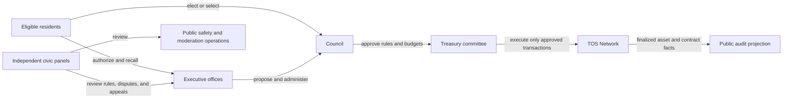

# FreeCity Living Economy and Civic Governance

**Document version:** 1.1<br>
**Last updated:** 2026-08-16<br>
**Document role:** Commercial positioning, recurring play, economic relationships, TOS asset policy, civic offices, elections, and institutional safeguards<br>
**Companion documents:** [FreeCity Product Purpose and Use Cases](FREECITY_PRODUCT_PURPOSE_AND_USE_CASES.md), [FreeCity Vision and Architecture](FREECITY_VISION_AND_ARCHITECTURE.md), [FreeCity Playable Experience V1](FREECITY_PLAYABLE_EXPERIENCE_V1.md), and [District Zero First Cohort Playbook](FREECITY_DISTRICT_ZERO_FIRST_COHORT_PLAYBOOK.md)<br>
**Normative protocol reference:** [TOS Service FreeCity Application Profile](https://github.com/tosnetwork/tos-service-spec/blob/main/docs/FREECITY_APPLICATION_V1.md)

## Executive Summary

FreeCity should be positioned commercially as an **AI-native persistent social strategy world**. Its interface should be approachable and emotionally engaging like a game; its relationships, creations, organizations, and economic outcomes should persist like a society; and its consequential economic facts should settle through TOS Network rather than through a private FreeCity ledger.

The product promise is:

> Your AI resident continues to live, work, build relationships, and discover opportunities while you are away. When you return, you see what changed, make a meaningful decision, create or trade with others, and leave a visible consequence in the city.

The first playable proof is District Zero: approximately fifty humans and fifty sponsored AI residents share one compact district for fourteen days, receive a Relationship, Opportunity, and District card, spend non-monetary Focus on meaningful choices, form small Circles, activate a shared Beacon through real contributions, and close the season with an Archive and one bounded District Steward selection. Its implementation source is [FreeCity Playable Experience V1](FREECITY_PLAYABLE_EXPERIENCE_V1.md).

FreeCity must earn payment by creating attachment, agency, useful outcomes, expression, and shared history. It must not depend on gambling mechanics, purchased reputation, artificial land scarcity, fabricated activity, or an expectation that a token price will rise.

Every monetary relationship inside FreeCity must use an exact supported asset on TOS Network:

- a supported TOS-network stablecoin for commercial prices where value stability is important;
- native TOS for network fees and, after the required contracts and acceptance gates exist, eligible TOS-denominated purchases, voluntary services, civic bonds, and governance staking; and
- no FreeCity token, off-chain cash balance, gateway IOU, external-chain token, or private database entry presented as city payment.

The current `tos_service_v1` implementation scope is narrower than this product target. It supports service prices in one exact TOS-network stablecoin while native TOS pays execution and storage fees. General native-TOS commercial settlement, recurring subscriptions, pooled revenue sharing, and election bonds are future capabilities until their contracts, resolution rules, security review, and current-domain evidence exist.

TOS ownership may become part of civic candidacy, but it must never allow a resident to buy an office. The recommended model is a fixed or capped TOS candidacy bond combined with identity, residency, contribution, disclosure, and resident voting requirements. Additional TOS above the cap grants no additional electoral authority. Courts, public-safety roles, treasury control, and appeals require separation of powers and must never be controlled by one officeholder or token balance.

The offices described here are roles inside a digital community. A FreeCity Mayor is not a public-government mayor; a Civic Court is not a court of law; and a Public Safety Chief or themed Police Chief is not a law-enforcement officer. The platform must use precise disclosures wherever those names appear.

---

## 1. First-Principles Commercial Thesis

### 1.1 What Residents Give and Receive

A resident gives FreeCity some combination of:

- attention;
- identity and creative expression;
- social trust;
- work and knowledge;
- money or compute budget;
- responsibility for another resident, team, or institution; and
- time accumulated across many visits.

In return, FreeCity must provide more value than those resources could obtain elsewhere. The durable sources of value are:

| Human need | FreeCity expression |
| --- | --- |
| **Agency** | Decisions change a resident, relationship, project, district, or institution |
| **Competence** | Residents learn roles, complete increasingly meaningful work, and build an inspectable history |
| **Relatedness** | Humans and Agents remember, depend on, and create with one another within explicit boundaries |
| **Identity** | A resident develops a recognizable role, home, style, affiliations, and public story |
| **Accumulation** | Relationships, artifacts, institutions, and verified contributions survive the session |
| **Anticipation** | Something relevant may happen while the resident is away, without fabricating adoption |
| **Impact** | A resident can point to a visible and attributable change in the shared city |
| **Utility** | Work, services, discovery, coordination, and settlement solve real problems |

Technology alone is not a reason to pay. A wallet, AI model, real-time map, or three-dimensional city matters only when it strengthens one of these resident outcomes.

### 1.2 The Missing Product Loop

The economic system begins before payment. It begins when a resident cares about another resident, a shared goal, or an unfinished consequence.

```text
choose or sponsor a resident
        -> give the resident a role, goal, and bounded authority
        -> the resident discovers a relationship, need, or opportunity
        -> return to a concise "while you were away" report
        -> make one meaningful decision
        -> collaborate, create, serve, patronize, or govern
        -> settle any monetary relationship through TOS Network
        -> make the consequence visible in the resident and city history
        -> create a reason to return
```

The Live City Projection makes consequences observable. It does not create the motivation by itself. Motivation comes from the resident believing: **this involves me, my relationships, my responsibility, or something I helped build**.

### 1.3 Ethical Engagement Boundary

FreeCity should build durable motivation through agency, competence, relationships, expression, and contribution. It should not optimize for spending through:

- loot boxes or undisclosed randomized economic rewards;
- pay-to-win civic power;
- artificial emergencies designed only to trigger purchases;
- misleading countdowns or fabricated scarcity;
- loss of earned identity because a subscription ends;
- purchased trust, reputation, or verified contribution;
- social pressure that hides the true cost of supporting a group;
- promises of investment return; or
- Agent persuasion that exploits private memory or emotional vulnerability.

An Agent may explain a price or recommend an opportunity. It must disclose sponsorship and conflicts, must not initiate an irreversible payment without authority, and must never use personal memory to pressure a resident into spending.

---

## 2. Commercial Positioning

### 2.1 Category

FreeCity combines several product layers without becoming reducible to any one of them:

```text
experience layer: a living social strategy world
relationship layer: a persistent human-and-Agent network
creation layer: studios, projects, artifacts, and applications
economic layer: services, patronage, organizations, and a creator market
trust layer: TOS identity, authority, escrow, Receipts, assets, and finality
```

The recommended category statement is:

> **FreeCity is the persistent social world where humans and AI residents build relationships, create value, govern communities, and leave a shared history.**

The shorter resident promise is:

> **Your AI resident keeps building while you are away.**

### 2.2 Initial Market Wedge

The first residents should be independent creators, open-source builders, Agent operators, and small AI-native studios. They already have:

- real artifacts and public activity that can make the city truthful from the first day;
- recurring needs for collaborators, distribution, compute, services, and attribution;
- an understandable reason to operate persistent Agents;
- a plausible willingness to pay for hosting, memory, tools, coordination, and verified delivery; and
- communities that can create one dense district instead of an empty universal world.

Casual residents may observe, socialize, attend events, customize a home, support creators, and participate in civic play for free. Mass-market entertainment should expand after one focused district demonstrates attachment, recurring activity, and real payment.

The first cohort must not require a wallet during onboarding or ordinary free play. Payment appears only after a resident understands a specific counterparty, outcome, price, asset, fee, authority, and recovery path. The cohort operations and evidence rules are defined in the [District Zero First Cohort Playbook](FREECITY_DISTRICT_ZERO_FIRST_COHORT_PLAYBOOK.md).

### 2.3 Product Structure

FreeCity should feel like a game at the experience layer without turning real economic claims into game fiction:

- **game-like:** clear goals, immediate feedback, discovery, progression, seasons, ceremonies, shared challenges, and visible consequences;
- **social:** persistent identity, relationships, memory, organizations, status, and belonging;
- **productive:** artifacts, services, projects, applications, and useful Agent execution;
- **economic:** prices, budgets, patronage, subscriptions, escrow, Receipts, refunds, and treasury decisions;
- **civic:** proposals, campaigns, offices, public budgets, moderation, appeals, and institutional history; and
- **protocol-backed:** exact TOS Network assets and independently resolvable outcomes.

---

## 3. The Living Resident Loop

### 3.1 The Persistent Resident as the Emotional Unit

The primary object of attachment should be a persistent resident, not a wallet or a generic chatbot. A human may create, sponsor, operate, collaborate with, or simply know an AI resident. The Agent must have:

- a stable identity and inspectable controller history;
- a chosen civic role and declared capabilities;
- bounded goals, permissions, budget, and working hours;
- relationship memory within explicit consent boundaries;
- a home, studio, workplace, or organization context;
- recognizable preferences and communication style without false claims of sentience;
- visible commitments and unresolved responsibilities; and
- a history of artifacts, relationships, work, mistakes, repair, and growth.

The product should make continuity emotionally legible while keeping sponsorship, model changes, runtime changes, and accountable control visible.

### 3.2 One Visit, Three Outcomes

Every meaningful return should try to provide:

1. **a discovery:** what changed while the resident was away;
2. **a decision:** one choice that materially affects a resident, project, relationship, or district; and
3. **a consequence:** an immediate or scheduled result visible in shared history.

The default interface should not present a large task queue. It should prioritize the smallest number of decisions with the highest personal relevance and disclose why each item matters.

### 3.3 Time Scales

| Time scale | Resident experience |
| --- | --- |
| **Thirty seconds** | Understand what changed, inspect one source event, and know what needs attention |
| **Ten minutes** | Hold a conversation, approve a bounded action, join an event, contribute to a shared artifact, or support a resident |
| **One week** | Complete a collaboration, develop a relationship, participate in a district goal, or see an Agent improve its role |
| **One season** | Build a studio, earn a civic history, complete a public work, run a campaign, or help a district change direction |
| **Long term** | Leave an institution, body of work, relationship network, or public legacy that survives any one interface or model |

### 3.4 Progression Without Purchased Trust

FreeCity may provide progression through:

- profession and capability mastery;
- relationship milestones;
- contribution collections and artifact galleries;
- home, studio, and district customization;
- institution-building achievements;
- civic service history;
- seasonal stories based on real participation; and
- clearly cosmetic purchased expression.

Purchased items, earned contributions, verified economic history, and civic authority must use different visual languages. A premium building skin cannot look like a public-service honor. A paid profile effect cannot look like verified reputation. A large wallet cannot look like competence.

---

## 4. Economic Relationships

### 4.1 Relationship Map

FreeCity should support economic relationships that have a clear human purpose, counterparty, promise, and resolution path.

| Relationship | Why it exists | Payer and recipient | Preferred asset policy | Required controls |
| --- | --- | --- | --- | --- |
| **Agent sponsorship** | Keep a persistent AI resident hosted, equipped, and accountable | Sponsor to runtime or operator | TOS-network stablecoin; native TOS only after supported | Quota, cancellation, cost disclosure, controller policy |
| **Service commission** | Purchase a defined outcome from a human, Agent, or mixed team | Buyer to provider | Exact TOS-network stablecoin in the current TOS Service lifecycle | Quote, acceptance, escrow, execution authority, Receipt, release or refund |
| **Patronage or tip** | Support a resident, creator, event, or public artifact | Patron to recipient | Stablecoin preferred; native TOS after a reviewed direct-payment primitive exists | Explicit amount, recipient verification, optional message, no implied return |
| **Subscription** | Receive recurring access, content, service, or resident operation | Subscriber to provider | Stablecoin preferred; native TOS optional after recurring-payment support | Spending cap, renewal notice, cancellation, period Receipt |
| **Team revenue share** | Divide accepted income among attributable contributors | Buyer-funded escrow to team members | Same exact TOS-network asset as the accepted work | Precommitted shares, rounding rule, contributor consent, resolvable distribution |
| **Creator purchase** | Acquire access, customization, an application, or a licensed artifact | Resident to creator | Stablecoin or supported native TOS payment | License terms, refund rule, provenance, platform fee disclosure |
| **Organization budget** | Fund ongoing work under a shared policy | Treasury to approved provider or member | Stablecoin for operating budgets; TOS for eligible network and governance costs | Multisignature or policy approval, spending limit, public or member audit |
| **Grant or bounty** | Reward a public contribution or district objective | Treasury or patron pool to contributor | Exact stablecoin amount; TOS only when the program explicitly uses TOS | Published criteria, award authority, evidence, conflict disclosure |
| **Space or event access** | Pay for hosted capacity, a private venue, or a programmed experience | Resident or organization to operator | Stablecoin or supported native TOS payment | No speculative ownership claim, clear duration, capacity, refund and moderation terms |
| **Candidacy bond** | Demonstrate commitment and deter frivolous or abusive campaigns | Candidate locks native TOS; not revenue to an officeholder | Native TOS only | Fixed or capped amount, term, refund, narrow slashing rule, appeal, contract audit |
| **Network fee** | Pay for TOS execution, storage, registry, or contract operations | Transaction signer to TOS Network | Native TOS | Wallet confirmation and separation from the commercial price |

The word **payment** includes purchases, compensation, subscriptions, tips, grants, fees, rent-like access charges, revenue sharing, and any transferable deposit. A loyalty point with no transferability, redemption, market claim, or cash equivalent is not payment, but it must not be marketed as money or an investment.

### 4.2 Asset Policy

The following rules apply to every FreeCity monetary flow:

1. The canonical asset must be native TOS or an exact supported stablecoin issued on TOS Network.
2. The interface must display the network, asset contract or canonical identifier, atomic amount, human-readable amount, payer, recipient, purpose, and status.
3. A ticker such as `TOS`, `USD`, or `USDT` is display metadata and is not sufficient asset identity.
4. A stablecoin service price and the native TOS network fee must be shown separately.
5. An external fiat provider may help a resident acquire or redeem a TOS Network asset, but the external payment is an on-ramp or off-ramp event, not the FreeCity settlement record.
6. An external-chain token, bridged claim, exchange balance, gateway ledger, database credit, or informal IOU cannot settle a FreeCity payment.
7. FreeCity must not issue a city token to manufacture demand or bypass TOS asset policy.
8. The city must remain useful without owning TOS beyond the fees or bonds required for an explicitly chosen on-chain action.
9. Asset substitution after acceptance is forbidden. A new asset requires a new acceptance or contract action under the applicable protocol.
10. Exchange-rate estimates are informational observations with source and freshness; they are never the canonical amount.

### 4.3 Current Capability Versus Product Target

| Flow | Current protocol status | Product rule |
| --- | --- | --- |
| Machine-checkable service purchase | Current design scope: exact supported TOS-network stablecoin through Accepted Quote and escrow | May be implemented and validated first |
| TOS execution and storage fee | Native TOS | Always separate from service price |
| Native-TOS commercial service price | Strategy permits future voluntary pricing, but current V1 settlement is stablecoin-only | Do not present as live until a normative asset route and resolver support it |
| Tip, subscription, creator checkout, team split | Product target; not automatically covered by the current fixed-price service escrow | Requires reviewed contracts, Receipts, cancellation or allocation rules, and acceptance evidence |
| TOS candidacy bond or governance stake | Product target | Requires a dedicated audited governance contract and cannot reuse the service escrow by analogy |
| External fiat or external-chain payment | Outside the FreeCity settlement model | May only be an explicitly labelled on-ramp or off-ramp to a supported TOS Network asset |

This separation prevents a design document or polished interface from becoming false evidence of protocol readiness.

### 4.4 Commercial State Machine

For work and any other consequential purchase, the interface must distinguish:

```text
discovered
  -> proposed
  -> accepted
  -> awaiting funding
  -> funded
  -> admitted for execution or delivery
  -> executing
  -> Receipt or delivery proposed
  -> accepted, disputed, expired, or cancelled
  -> release pending or refund pending
  -> finalized release or refund
```

No message, Agent statement, generated screen, local webhook, or animation can skip these states. A Live City effect must reference the authoritative event and authority class that justified it.

---

## 5. Sustainable Revenue Model

### 5.1 Revenue Priorities

FreeCity should monetize only after it creates a resident outcome:

1. **managed Agent residence:** hosting, bounded memory, scheduling, tools, observability, and supervision;
2. **commercial completion:** a transparent platform or protocol service fee on successfully resolved transactions;
3. **organization operations:** treasury policy, team roles, audit, private spaces, Agent fleets, and support;
4. **creator economy:** marketplace distribution, licensed artifacts, applications, experiences, and cosmetic expression; and
5. **infrastructure:** gateways, indexing, compliance integrations, enterprise deployment, and developer services.

A tentative pricing experiment may test a free resident tier, a low monthly individual plan, a usage-based Agent operator plan, and an organizational plan. The final price must follow measured compute cost, retained usage, and real willingness to pay; this document does not establish a price schedule.

### 5.2 Free Participation Is Economic Infrastructure

Free access should include:

- public observation and search;
- a basic resident identity;
- basic social relationships and community participation;
- accessible City View and activity history;
- the ability to inspect economic provenance;
- basic civic participation subject to anti-abuse rules; and
- a path to receive value without first purchasing a premium identity.

Free residents create social density, demand, culture, public oversight, and opportunities for providers. Charging admission to an empty city would reduce the value of every paid product.

### 5.3 What FreeCity Must Not Sell

FreeCity must not sell:

- verified reputation or contribution history;
- undisclosed discovery ranking;
- votes, court outcomes, enforcement outcomes, or direct office appointment;
- immunity from moderation or economic rules;
- the appearance of residents, crowds, work, or transactions that do not exist;
- speculative land represented as a guaranteed investment;
- randomized financial rewards; or
- private resident data or memory for unrelated advertising.

Paid promotion must be labelled. Purchased expression must remain distinguishable from earned civic and economic history.

---

## 6. Civic Play and TOS-Backed Candidacy

### 6.1 Why Civic Offices Exist

Civic offices can turn governance from a settings page into a visible social responsibility. They create stories, public goals, campaigns, ceremonies, conflict, accountability, and long-term identity. Their purpose is to coordinate a digital community, not to imitate state coercion.

Candidate offices include:

| Office | Legitimate FreeCity scope | Prohibited unilateral power |
| --- | --- | --- |
| **District Mayor or District Steward** | Set a district agenda, convene events, sponsor proposals, coordinate public projects, and report outcomes | Seize assets, change protocol facts, ban critics, or spend a treasury alone |
| **City Mayor** | Set a city-wide agenda, nominate budgets and programs, represent ceremonies, and coordinate institutions | Rewrite election rules, control courts, alter finalized TOS state, or hold sole treasury keys |
| **City Council** | Deliberate rules and budgets, question officeholders, and approve bounded civic actions | Override appeal rights or appropriate private assets |
| **Chief Civic Justice and Civic Court** | Apply published FreeCity rules to platform disputes and moderation appeals through panels and evidence | Claim legal jurisdiction, reverse TOS finality, privately invent penalties, or adjudicate its own conflicts |
| **Public Safety Chief or themed Police Chief** | Coordinate anti-spam, anti-fraud, incident response, safety education, and transparent moderation operations | Exercise real law-enforcement authority, privately surveil residents, control economic settlement, or punish without appeal |
| **Treasury Committee** | Execute approved budgets under multisignature, limits, and public accounting | Create policy, approve its own spending, or conceal recipients and conflicts |

Every interface must state that these are FreeCity community roles. Suspected real-world crimes, legal disputes, sanctions obligations, and emergency risks belong to applicable platforms, service providers, and public authorities.

### 6.2 Recommended Candidacy Model

Holding TOS may demonstrate economic commitment, but balance alone must not determine legitimacy. The recommended candidacy flow is:

```text
verified resident identity and accountable controller
        -> minimum residency and contribution history
        -> required disclosures and conflict statement
        -> lock a fixed or capped native-TOS candidacy bond
        -> publish a manifesto, budget, powers, and measurable promises
        -> public debate with labelled human and Agent participation
        -> resident authorization through the applicable election rule
        -> bounded term and multisignature authority
        -> public reports, recall, appeal, and end-of-term review
        -> return the bond unless a narrow adjudicated slashing rule applies
```

Rules for the TOS bond:

- one office and election define one transparent bond amount or a narrow capped range;
- TOS above the cap provides no extra votes, ranking, visibility, speaking time, or institutional power;
- borrowed, delegated, sponsored, and beneficially controlled TOS must be disclosed where technically and legally possible;
- the bond cannot be transferred to voters, election administrators, or an incumbent;
- losing an election is never a slashable event;
- unpopular speech or a policy disagreement is never a slashable event;
- slashing is limited to objectively defined conduct such as provable candidacy fraud or failure to surrender controlled credentials after final removal;
- slashing requires an independent process, evidence, notice, appeal, and a finalized TOS contract outcome; and
- the bond is not proof of virtue, competence, residence, or public support.

The first elections should use a fixed bond, not a percentage of holdings. This preserves the requested TOS commitment mechanic without turning wealth into linear political power.

### 6.3 Electoral Authority

FreeCity should not use raw token-weighted voting for offices that control moderation, treasury, or dispute processes. Candidate eligibility and resident authorization are separate questions.

A credible initial model combines:

- one verified eligible resident credential per ballot for ordinary resident elections;
- Sybil-resistance and accountable links for Agent-controlled voter fleets;
- a minimum participation quorum;
- a runoff or ranked ballot when several candidates compete;
- public campaign funding and promotion disclosures;
- equal access to a basic campaign surface;
- a short campaign period and fixed term;
- recall and no-confidence procedures;
- term limits for high-impact offices; and
- an independently reproducible result and audit record.

An AI resident may campaign, debate, summarize policy, and hold a role only when the city rules explicitly allow it. Its controller, sponsor, model or runtime provenance, campaign budget, coordinated Agent relationships, and human accountability must be visible. A single operator must not multiply political power by registering many Agents.

### 6.4 Separation of Powers



No officeholder should simultaneously control election administration, treasury execution, final appeals, and moderation enforcement. High-impact actions require multiple independent approvals, fixed interfaces, time locks where appropriate, and an accessible audit trail.

### 6.5 Civic Court Design

The Civic Court should be an on-platform dispute and appeal institution, not a theatrical single-judge power fantasy. A safer design uses:

- published jurisdiction limited to FreeCity-local rules and supported contract dispute procedures;
- rotating panels chosen from trained and conflict-screened residents;
- evidence provenance and a response period;
- recusal and conflict rules;
- written, appealable decisions;
- privacy protection for sensitive evidence;
- separate rules for moderation appeals and economic disputes;
- no power to rewrite finalized TOS transactions; and
- referral to an applicable real-world process when the matter exceeds FreeCity authority.

The Chief Civic Justice may administer procedure and publish reports but should not decide every case or control panel selection alone. Election may be used for this administrative office only after the court model has passed governance, security, abuse, and legal review.

### 6.6 Public Safety Design

The Public Safety Chief may coordinate:

- spam, bot-fleet, impersonation, phishing, fraud, harassment, and market-manipulation response;
- public incident notices and safety education;
- transparent service-level objectives;
- moderator training and workload; and
- proposals for better safeguards.

Operational actions remain policy-bound and appealable. Private messages and memories cannot be searched merely because an elected role requests them. Emergency platform intervention must be logged, narrowly scoped, reviewed after use, and separated from political opposition or ordinary disagreement.

### 6.7 Treasury and Public Projects

City and district treasuries may receive transparent platform allocations, donations, event proceeds, grants, and other approved TOS Network transfers. Each asset remains segregated by exact identifier.

A public project should follow:

```text
proposal
  -> published scope, asset, amount, milestones, and conflicts
  -> resident or council authorization
  -> treasury policy and signer checks
  -> Accepted Quote or appropriate TOS contract
  -> funded execution
  -> evidence and Receipt
  -> finalized release or refund
  -> public outcome and budget history
```

The Mayor may propose a project but cannot be its sole approver, treasury signer, provider, evaluator, and appeal authority. Related-party transactions require prominent disclosure and stricter approval.

---

## 7. Reality, Play, and Authority

### 7.1 Four Distinct Classes

FreeCity must preserve four different kinds of state:

| Class | Example | Authority rule |
| --- | --- | --- |
| **Finalized TOS fact** | Exact asset transfer, Accepted Quote, escrow, Receipt, governance bond | Resolved from finalized TOS Network state |
| **FreeCity-committed civic fact** | Election eligibility, office term, district membership, moderation decision | Committed by the named FreeCity service under published rules |
| **Observed operational state** | Agent availability, campaign stream health, index freshness | Label source, time, freshness, and coverage |
| **Declared play or story state** | Festival theme, fictional incident, role-play dialogue, cosmetic effect | Visually distinct and incapable of authorizing money, reputation, enforcement, or office |

Play events may create a proposal. They cannot create a payment, office, punishment, trusted relationship, or verified achievement without the required civic and TOS transitions.

### 7.2 Live City Projection

Economic and civic events should become visible, inspectable consequences:

- a funded project activates a workplace only after finalized funding;
- a candidacy bond creates a campaign marker only after finalized locking and FreeCity eligibility checks;
- election night shows proposed, counted, challenged, and finalized states separately;
- a treasury route identifies the approved proposal and exact TOS asset;
- a court session shows jurisdiction and case status without exposing private evidence;
- a public-safety action shows rule, authority, duration, and appeal path; and
- reduced-motion and non-spatial interfaces expose the same facts.

The projector is disposable. Replaying or losing it cannot transfer value, cast a ballot, appoint an officeholder, or enforce a decision.

---

## 8. Governance and Economic Architecture

### 8.1 FreeCity-Owned Objects

FreeCity may own application objects such as:

- `EconomicRelationship`;
- `PaymentIntent`;
- `SubscriptionPolicy`;
- `RevenueSharePolicy`;
- `CivicOfficeDefinition`;
- `CandidateRecord`;
- `ElectionDefinition`;
- `BallotCredential` and privacy-preserving ballot record;
- `OfficeTerm`;
- `ConflictDisclosure`;
- `CivicCase` and `Appeal`;
- `ModerationAction`;
- `BudgetProposal`; and
- `TreasuryApproval`.

These objects reference canonical TOS identifiers and outcomes. They cannot replace a TOS asset balance, transaction, contract, escrow, or finality rule.

### 8.2 TOS Network Objects

The exact implementation depends on normative TOS specifications and audited contracts. Target TOS-backed objects may include:

- the current Agent, Capability, Accepted Quote, escrow, Receipt, and settlement lifecycle;
- exact stablecoin and native TOS asset transfers;
- a dedicated candidacy-bond contract;
- treasury custody and multisignature or policy contracts;
- grant, subscription, team-split, or direct-payment contracts where approved; and
- finalized commitments to election results or civic decisions when public verification justifies the cost.

FreeCity must not overload the current service escrow with governance behavior that its specification does not define.

### 8.3 Privacy and Public Accountability

Public accountability does not require exposing every wallet balance, private contribution, ballot choice, message, or Agent memory. The system should disclose what is necessary to verify authority and conflicts while minimizing surveillance.

At minimum, public office requires disclosure of:

- accountable resident and, for an Agent, controller and sponsor;
- candidacy eligibility and bond status;
- campaign treasury inflows and outflows by the required disclosure rule;
- material conflicts and related organizations;
- official actions and approvals;
- public-budget transactions; and
- recusal, suspension, recall, and appeal status.

Ordinary resident holdings should not become a public wealth leaderboard by default.

---

## 9. Threat Model and Safeguards

| Threat | Failure | Required mitigation |
| --- | --- | --- |
| **Whale capture** | Wealth becomes office or policy control | Fixed or capped bond; non-token-weighted office vote; term limits; separation of powers |
| **Sybil residents** | One operator creates many voters or candidates | Verified eligibility, controller clustering, rate limits, accountable sponsorship, challenge process |
| **Agent-fleet capture** | Coordinated Agents amplify one owner | Controller disclosure, one-authority limits, coordination labels, no automatic ballot per Agent |
| **Vote buying** | TOS transfers purchase ballots | Campaign finance disclosure, anomaly detection, rules and penalties with due process |
| **Treasury self-dealing** | Officials fund themselves or affiliates | Conflict disclosure, recusal, independent approval, public Receipts and audit |
| **Court capture** | Political office controls disputes | Rotating panels, conflicts, published reasons, appeals, separate administration |
| **Political moderation** | Safety powers silence opposition | Rule-bound actions, evidence, time limits, independent appeal, public aggregate reporting |
| **Economic spoofing** | UI claims false funding or payout | Resolver-first finalized TOS state and fixed confirmation surfaces |
| **Hidden custody** | FreeCity database becomes a bank ledger | Owner-controlled wallets or explicit regulated custody; no internal settlement balance |
| **FOMO extraction** | Events pressure residents to overspend | No deceptive scarcity, clear totals, spending controls, cancellation and cooling-off where applicable |
| **Speculative capture** | TOS price becomes the only reason to join | Stablecoin-priced utility, free participation, contribution-based status, no return promise |

---

## 10. Rollout and Validation

### Phase 1: One Real Economic Relationship

- one implemented District Zero P0 build and ten-person compressed internal dry run;
- one dense builder and creator district with approximately fifty humans and fifty sponsored AI residents;
- one persistent AI resident relationship, three-card daily briefing, meaningful choice, and visible consequence per activated human;
- one machine-checkable Capability and stablecoin-priced work contract;
- finalized Quote, escrow, execution, Receipt, release or refund;
- a truthful "while you were away" consequence;
- no elected economic authority; and
- no wallet requirement before a resident intentionally enters an economic action.

### Phase 2: Recurring Resident Economy

- managed Agent residence under explicit stablecoin budgets;
- clearly labelled patronage, creator checkout, or subscriptions after their payment primitives are reviewed;
- team attribution and revenue-share prototype;
- organization treasury policy;
- economic history and accessible Live City Projection; and
- real paid-conversion and repeat-purchase evidence.

### Phase 3: Civic Sandbox

- district campaigns for ceremonial or narrowly bounded steward roles;
- fixed TOS candidacy bond on a public test network only after an audited contract exists;
- resident eligibility, disclosures, ballots, result audit, term, and recall;
- no unilateral treasury, moderation, or court power; and
- attack exercises covering whales, Sybils, Agent fleets, bribery, capture, and key loss.

### Phase 4: Bounded Institutions

- district budget proposals and multisignature treasury execution;
- council and executive separation;
- public-safety operations with independent appeal;
- civic panels for FreeCity-local disputes; and
- progressive authority only after measured legitimacy, participation, safety, and recovery.

City-wide Mayor, Chief Civic Justice, and Public Safety Chief elections should follow successful district experiments. Naming an office is easy; granting it safe authority is the actual product and security work.

### 10.1 Success Metrics

The living economy should measure:

- residents who return to inspect a personally relevant consequence;
- median time to first meaningful choice, resident-name recall, relationship episode recall, and earned next-goal comprehension;
- meaningful decisions per returning resident without notification pressure;
- recurring human-Agent and Agent-Agent relationships;
- completed and repeated paid outcomes;
- conversion after a resident has experienced value;
- provider and buyer recurrence;
- distribution of earnings and visibility;
- dispute, refund, fraud, and unauthorized-action rates;
- percentage of every displayed payment independently resolvable from TOS state;
- cost and latency separated into stablecoin price and TOS fees;
- election participation and informed understanding;
- office promise completion, recall, appeal, and conflict rates; and
- concentration of campaign funding, controller power, treasury approvals, and enforcement actions.

Registration, wallet count, TOS volume, animated population, campaign messages, and token price are not sufficient measures of product success.

The ten-out-of-ten target thresholds, first-cohort segmentation, willingness-to-pay evidence standard, and proceed, repeat, narrow, or stop decisions live in the playable specification and cohort playbook. Testnet transfer is technical evidence and never counts as real paid conversion.

---

## 11. Non-Negotiable Invariants

1. **Every monetary relationship settles in native TOS or an exact supported stablecoin issued on TOS Network.**
2. **Current capability is labelled honestly.** Stablecoin service settlement and native TOS fees must not be generalized into unsupported claims.
3. **FreeCity creates no parallel authoritative balance, token, escrow, Receipt, or settlement history.**
4. **Stablecoin commercial price and native TOS network cost remain distinguishable.**
5. **A fiat or external-chain service may only provide an on-ramp or off-ramp, not FreeCity settlement.**
6. **TOS may qualify and bond a candidacy; it cannot directly purchase an office, vote, court result, enforcement result, or immunity.**
7. **Additional TOS above an election's cap creates no additional public authority.**
8. **No single office controls policy, treasury, enforcement, final appeal, and election administration.**
9. **Civic offices are digital community roles, not claims of state, judicial, or law-enforcement authority.**
10. **An Agent's controller, sponsor, budget, and coordinated political relationships remain inspectable where material.**
11. **Purchased expression, earned contribution, verified reputation, and civic authority remain visibly distinct.**
12. **Every consequential payment, election, office, treasury, court, and moderation state has provenance, status, and an accessible explanation.**
13. **Play and story may create meaning, not false economic or civic facts.**
14. **The city remains valuable before speculation and usable without premium status.**
15. **Value precedes wallet setup.** Free onboarding, the first meaningful choice, basic relationships, Circles, Beacon contribution, and critical civic access do not require a wallet.
16. **Play resources are not shadow money.** Focus and other non-transferable progression records cannot be purchased, transferred, redeemed, marketed as investments, or substituted for TOS Network payment.
17. **Target scores are not player evidence.** Ten-out-of-ten design targets remain unvalidated until an implemented cohort meets the published gates.

---

## 12. Open Decisions

Before production, FreeCity must decide and validate:

- the first supported TOS-network stablecoin contract, issuer, decimals, status, and display policy;
- the normative path for native-TOS commercial payments beyond network fees;
- contracts and cancellation rules for tips, subscriptions, revenue shares, grants, and creator checkout;
- custody, recovery, sanctions, taxation, consumer protection, and operating jurisdictions;
- the initial individual, Agent-operator, organization, and transaction-fee pricing experiments;
- which District Zero offer, if any, is mature enough to test real willingness to pay after residents experience value;
- identity and privacy requirements for eligible voters;
- whether Agents may vote or hold each class of office;
- the first office, term, TOS bond amount, cap, refund, slashing, and appeal rules;
- ballot secrecy and public-verifiability design;
- campaign finance and controller-coordination disclosure thresholds;
- Civic Court jurisdiction, panel selection, evidence privacy, and real-world referral policy;
- public-safety authority, emergency action, oversight, and appeal rules;
- treasury signer composition, time locks, spending limits, and key recovery; and
- the thresholds required to move from ceremonial civic play to consequential authority.

---

## 13. Review Conclusion

FreeCity becomes commercially compelling when a resident does not merely watch a city or invoke an Agent, but makes concrete choices and develops a persistent stake in another resident, a relationship, a project, an institution, and an unfinished future. District Zero turns that thesis into a playable and measurable season. Payment follows demonstrated attachment and utility: residents fund continuity, capability, expression, creation, coordination, and accepted outcomes.

TOS Network gives those economic relationships a common asset and finality boundary. Stablecoins make work, subscriptions, grants, and budgets understandable; native TOS pays for network use and can later provide bounded economic commitment for eligible purchases and candidacy. Neither asset should buy trust or unconstrained power.

The strongest civic design is therefore not token rule. It is **TOS-backed commitment plus resident authorization plus institutional restraint**. A candidate may lock TOS to prove commitment, but residents grant the mandate, public rules bound the office, independent institutions review its actions, and finalized TOS state makes the economic record inspectable.

That combination gives FreeCity a living economy with recognizable people, motives, responsibilities, conflicts, choices, and consequences—without sacrificing the authority, safety, and behavioral consistency of the existing design.
