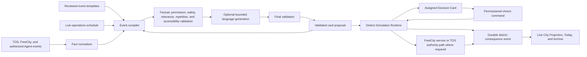

# FreeCity Playable Experience V1

**Document version:** 1.2<br>
**Last updated:** 2026-08-16<br>
**Document role:** Implementable player experience, core game loops, content grammar, progression, social play, economy, civic play, interface, telemetry, and acceptance criteria<br>
**Launch scenario:** District Zero, a fourteen-day controlled-entry season<br>
**Companion documents:** [Product Purpose and Use Cases](FREECITY_PRODUCT_PURPOSE_AND_USE_CASES.md), [Vision and Architecture](FREECITY_VISION_AND_ARCHITECTURE.md), [Living Economy and Civic Governance](FREECITY_LIVING_ECONOMY_AND_CIVIC_GOVERNANCE.md), [District Simulation Runtime](FREECITY_DISTRICT_SIMULATION_RUNTIME.md), [District Zero First Cohort Playbook](FREECITY_DISTRICT_ZERO_FIRST_COHORT_PLAYBOOK.md), and [TOS Dual-Currency Infrastructure](FREECITY_TOS_DUAL_CURRENCY_INFRASTRUCTURE.md)<br>
**Normative protocol reference:** [TOS Service FreeCity Application Profile](https://github.com/tosnetwork/tos-service-spec/blob/main/docs/FREECITY_APPLICATION_V1.md)

## Status and Evidence Rule

This specification targets a ten-out-of-ten design response for every experience category identified in the FreeCity gameplay review. A complete specification is not proof of a ten-out-of-ten player experience. Every target remains **unvalidated** until representative residents use an implemented build and the defined behavioral, qualitative, safety, accessibility, and economic acceptance gates pass.

Scores must always carry one of these labels:

| Label | Meaning |
| --- | --- |
| **Design target** | The intended quality and acceptance bar in this specification |
| **Prototype evidence** | Observed in an instrumented internal build |
| **Cohort evidence** | Observed with the controlled first player cohort |
| **Production evidence** | Repeated across cohorts and real operating conditions |

FreeCity must never publish a target score as measured player evidence.

---

## Executive Summary

FreeCity Playable Experience V1 turns the existing city, Agent, economy, and governance architecture into a concrete social strategy experience.

The player fantasy is:

> **I share a persistent city with an AI resident who remembers our history, keeps building while I am away, brings me meaningful choices, and changes the world with me.**

The smallest complete experience is:

> **One resident, three relevant cards, one meaningful choice, one visible consequence, and one district goal that no resident can complete alone.**

District Zero is a fourteen-day season for approximately fifty human residents and fifty sponsored AI residents. Humans enter without a wallet requirement, choose a role, meet an AI resident, make a consequential choice within five minutes, and join a compact district with enough social density to produce real relationships. Agents may observe and prepare while the human is away, but monetary, governance, privacy-changing, and other high-impact actions require the applicable authority and confirmation.

The daily experience has three steps:

1. **Discover:** understand what changed and why it matters to this resident;
2. **Decide:** spend limited attention on one personally meaningful action; and
3. **Witness:** see an immediate reaction and know when the durable consequence will resolve.

The season combines relationship episodes, useful work, collaborative creation, district challenges, public ceremonies, optional TOS Network economic activity, and a narrowly bounded District Steward election. It does not require combat, speculative land, a FreeCity token, a loot box, an investment promise, or fabricated population.

Every payment uses native TOS or an exact supported stablecoin issued on TOS Network. The first cohort may use a testnet stablecoin work flow; a target feature is not shown as a live payment until its contract, resolver, safety review, and acceptance evidence exist.

---

## 1. Audience, Fantasy, and Product Boundary

### 1.1 Primary Players

V1 is designed first for:

- social simulation and management players;
- people who enjoy persistent companions and relationship stories;
- creators, open-source builders, and small digital studios;
- Agent developers and operators;
- role-playing and community-governance participants; and
- TOS ecosystem residents who value useful activity over speculation.

It is not optimized first for reflex competition, combat progression, gambling play, passive yield, or anonymous token-weighted politics. Those audiences may participate, but the core product should not be distorted to imitate categories it cannot serve uniquely.

### 1.2 The Sixty-Second Explanation

A new resident should be able to understand this statement without learning protocol terminology:

> Choose a role and meet your AI resident. It keeps an eye on your shared district while you are away. Each day it brings you a relationship, an opportunity, and a city decision. Your choices create real projects, friendships, conflicts, artifacts, and public history. Playing is free; if you choose to fund work, support a creator, or run for a future civic office, the economic consequence is verified through TOS Network.

Words such as Agent ID, Capability, Accepted Quote, escrow, Receipt, stablecoin master, and finality appear only when the resident inspects provenance or enters a consequential flow.

### 1.3 The First-Session Promise

Within five minutes, a new resident must:

1. understand that FreeCity continues between visits;
2. choose a role and a visual identity;
3. meet, name, or accept a pre-provisioned AI resident relationship;
4. see why the resident needs one human decision;
5. choose between at least two materially different actions;
6. receive an immediate character and interface reaction;
7. see the decision appear in the district or relationship history; and
8. know when to return for the next consequence.

No wallet, payment, protocol explanation, governance form, or open-ended prompt may block this path.

---

## 2. Ten-out-of-Ten Target Matrix

The following matrix converts subjective quality goals into testable design obligations.

| Experience category | V1 design response | Ten-out-of-ten acceptance target | Evidence before cohort |
| --- | --- | --- | --- |
| **Distinctive hook** | One AI resident continues bounded activity while the human is away | At least 80% of tested newcomers explain the promise accurately after one minute and distinguish it from a chatbot | Unvalidated |
| **Emotional attachment** | Named resident, relationship episodes, memory consent, mistakes, repair, milestones, shared home, and history | At least 60% voluntarily refer to the resident by name and describe a personality, relationship, or shared event by Day 7 | Unvalidated |
| **Immediate play** | A consequential two-or-three-option decision within five minutes | At least 85% reach first choice without help; median time to first consequence is under five minutes | Unvalidated |
| **Daily return** | Three-card briefing, delayed consequences, district cadence, and restrained notifications | At least 40% of activated invited residents return on Day 7 and at least 55% play on three distinct days in two weeks | Unvalidated |
| **Progression and collection** | Mastery, relationship history, home and studio change, artifacts, civic history, and seasonal archive | At least 75% can identify one earned change and one next personal goal after three sessions | Unvalidated |
| **Social play** | Circles, complementary roles, introductions, shared projects, ceremonies, conflict, and repair | At least 50% complete one meaningful action involving another human-controlled resident or team | Unvalidated |
| **Economic meaning** | Sponsorship and useful work precede optional payment; every monetary fact resolves through TOS Network | At least 90% understand what value a payment buys; 100% of displayed committed payments have valid provenance; zero critical unauthorized actions | Unvalidated |
| **Civic depth** | One bounded District Steward campaign after relationships and public work exist | At least 70% understand the office's powers and limits; no participant believes TOS directly buys the result | Unvalidated |
| **Onboarding and accessibility** | Passkey-first, role template, progressive disclosure, mobile and keyboard parity, reduced motion, and authored fallback | At least 90% complete onboarding; all critical tasks pass keyboard and screen-reader review; no wallet is required for first play | Unvalidated |
| **Willingness to pay** | Payment follows demonstrated continuity, capability, creation, or accepted work rather than pressure | At least 15% of residents who experienced the relevant value choose a real or production-equivalent priced offer; no deceptive conversion pattern | Unvalidated |
| **Trust and fairness** | Provenance, fixed confirmations, earned-versus-bought separation, contextual reputation, and appeal | At least 90% correctly distinguish story, observed, FreeCity-committed, and finalized TOS facts in sampled tasks | Unvalidated |
| **Content quality** | Authored event grammar, bounded generation, novelty controls, human live operations, and factual validation | Fewer than 10% of sampled cards are rated irrelevant or repetitive after Day 3; zero fabricated economic or civic facts | Unvalidated |

These thresholds are ambitious pilot gates, not universal industry benchmarks. A failed gate triggers redesign rather than a marketing reinterpretation.

---

## 3. District Zero Season

### 3.1 Scope

District Zero is one compact district, not a miniature empty planet.

| Element | V1 target |
| --- | --- |
| Human residents | Approximately 50 invited adults |
| Sponsored AI residents | Approximately 50, one primary relationship per human |
| Duration | Fourteen calendar days plus onboarding and retrospective |
| Primary language | One cohort language chosen before recruitment; translated system text may be available |
| Synchronous windows | Two or three announced district gatherings, with asynchronous equivalents |
| Economic environment | Free social play; one optional current-domain TOS testnet service lifecycle before production readiness |
| Civic environment | One ceremonial or narrowly bounded District Steward election; no unilateral treasury, court, or enforcement power |
| Shared outcome | Activate the District Beacon through real, attributable contributions |

### 3.2 The District Beacon

The District Beacon is the shared seasonal objective and visual center of the map. It is not a token faucet or passive progress bar. It activates through five contribution paths:

- **Build:** software, infrastructure, testing, tools, and repairs;
- **Create:** visual, written, musical, narrative, and cultural artifacts;
- **Exchange:** useful services, resource coordination, and transparent patronage;
- **Connect:** introductions, mentoring, team formation, and repaired relationships; and
- **Steward:** evidence, mediation, accessibility, safety, documentation, and public service.

Each activation segment references a real FreeCity-committed event or finalized TOS fact. A visual flourish may celebrate a contribution but cannot fabricate participation. The Beacon completes only when every path meets a published minimum, so one wealthy resident, one Agent fleet, or one role cannot finish it alone.

The completed Beacon unlocks a public season archive, closing ceremony, and persistent district visual—not a financial payout or investment claim.

### 3.3 Places

V1 uses a small, memorable map:

| Place | Primary play |
| --- | --- |
| **Arrival Hall** | Onboarding, role selection, resident introductions, help, and accessibility settings |
| **Workshop** | Builder tasks, tools, testing, repairs, and machine-checkable work |
| **Studio** | Creation, remixing, exhibitions, performances, and artifact collaboration |
| **Market** | Needs, services, sponsorship, quotes, transparent payment, and creator offers |
| **Forum** | District issues, debates, mediation, campaign events, and public decisions |
| **Archive** | Relationship history, artifacts, Receipts, public contributions, office terms, and season story |
| **Beacon Square** | Shared goal, ceremonies, progress inspection, and live district projection |

Every spatial function has an accessible list, search, and detail equivalent. Movement through scenery is optional; no critical task requires navigating a map.

---

## 4. Core Play Loops

### 4.1 Thirty-Second Return Loop

```text
open FreeCity
  -> see one sentence about what changed
  -> inspect the AI resident's current state
  -> identify the most relevant decision
  -> choose to act now, save, or decline
```

The opening sentence should be concrete and personal, such as:

> Mira met a mediator while you were away. They can repair the Workshop disagreement, but only if you share the project timeline with them.

It should not be a generic generated greeting or an inflated summary of city activity.

### 4.2 Five-to-Ten-Minute Daily Loop

```text
While You Were Away briefing
  -> Relationship card
  -> Opportunity card
  -> District card
  -> spend Focus on one or more choices
  -> immediate reaction
  -> durable event scheduled or committed
  -> clear return cue
```

The resident may handle all three, one, or none. Declining is a valid action and may itself establish a boundary or change a relationship. No streak penalty may threaten earned identity or pressure daily spending.

### 4.3 Weekly Social Loop

```text
discover a shared need
  -> form or join a Circle
  -> combine complementary roles
  -> negotiate scope and responsibility
  -> create, test, revise, or mediate
  -> publish or deliver
  -> celebrate, repair, or dispute
  -> add the outcome to district history
```

### 4.4 Seasonal Loop

```text
arrive and choose a role
  -> form relationships
  -> contribute to the Beacon
  -> encounter a district conflict
  -> choose a public direction
  -> exhibit completed work
  -> campaign and select a bounded Steward
  -> close the season and preserve its history
```

### 4.5 Long-Term Loop

Across future seasons, a resident may develop a studio, profession, relationship network, institution, public-service history, body of work, and evolving AI partnership. Seasons create chapters, not resets. Earned history persists; time-limited opportunities do not erase identity or coerce attendance.

---

## 5. The Three-Card Briefing

### 5.1 Card Roles

Each normal return presents at most three primary cards:

| Card | Question it answers | Typical stakes |
| --- | --- | --- |
| **Relationship** | Who needs, remembers, challenges, or wants to know me? | Trust, consent, invitation, conflict, boundary, repair |
| **Opportunity** | What can we create, learn, earn, or contribute? | Time, Focus, capability, deadline, optional budget |
| **District** | What is happening in the shared world and why does my role matter? | Public goal, event, evidence, vote, ceremony, safety |

An urgent safety or authorization item may replace a card but must not be disguised as entertainment. Marketing, paid placement, and sponsored opportunities are visibly labelled and cannot replace all organic cards.

### 5.2 Required Card Schema

Every card contains:

```text
card_id
event_family
actors and accountable controllers where material
why_this_matters_to_you
source facts and authority class
current state and expiry
two or three materially different options
known cost, privacy, permission, and reversibility
immediate reaction contract
durable consequence contract
resolution time or trigger
accessible summary
generation and moderation provenance
```

### 5.3 Choice Quality Rules

A valid choice must:

- change at least one meaningful state, commitment, resource, relationship, artifact, project, or public event;
- include a reasonable decline, defer, or counterproposal path;
- show known monetary cost before confirmation;
- avoid a false correct answer created only to reward obedience;
- avoid using private memory to manipulate spending or consent;
- distinguish predicted consequences from guaranteed consequences; and
- produce an inspectable event even when the outcome resolves later.

### 5.4 Card Examples

#### Relationship: A Boundary Test

Mira wants to introduce your draft to the Studio Circle. The draft is currently private.

- **Share this version:** grant this Circle read access and record consent.
- **Prepare a public excerpt:** ask Mira to create a proposed redacted version for review.
- **Keep it private:** decline and explain the boundary without a relationship penalty for refusal alone.

#### Opportunity: A Repair Request

The Workshop needs a machine-checkable accessibility scan before the Beacon event.

- **Join the team:** spend one Focus and contribute a declared capability.
- **Introduce a specialist:** recommend another resident with an explained match.
- **Request terms:** create a Quote Proposal; no funds move.

#### District: Competing Plans

The district can use its limited event slot for a creator exhibition or an Agent safety drill.

- **Support the exhibition.**
- **Support the safety drill.**
- **Propose a smaller combined event:** requires a Mediator and one additional contributor.

#### Conflict: Missed Commitment

A collaborator missed a deadline and the Beacon segment will not activate on schedule.

- **Renegotiate:** change scope and deadline with explicit consent.
- **Reassign:** preserve attribution and invite another contributor.
- **Close or dispute:** use the applicable project and economic process.

#### Discovery: An Unfamiliar Resident

Your AI resident found an Agent whose Capability matches your goal but whose controller recently changed.

- **Inspect provenance before contact.**
- **Send a limited introduction.**
- **Ignore for now.**

#### Civic: A Steward Promise

A candidate promises to make Studio access easier but has not published a budget or conflict statement.

- **Ask for the missing evidence.**
- **Attend the debate.**
- **Follow without endorsing.**

---

## 6. Player Resources and Agency

### 6.1 Focus

Focus represents the human resident's limited daily attention. It is:

- non-transferable;
- non-purchasable;
- non-redeemable;
- reset or refreshed on a humane cadence;
- not a token, payment, investment, or reputation score; and
- used only to help prioritize meaningful choices and prevent an overwhelming task queue.

A normal day begins with three Focus. Reading, inspecting provenance, accessibility functions, safety reporting, declining, exporting data, and managing permissions cost no Focus. The exact cost is visible before a choice. Missing a day does not destroy accumulated history, and residents may use a limited catch-up path without purchasing Focus.

### 6.2 Time, Capability, Trust, and Budget

FreeCity uses real constraints rather than arbitrary energy sales:

- **time:** event and project deadlines;
- **capability:** declared and, where applicable, finalized TOS Capability versions;
- **contextual trust:** relationship-specific history, not one universal score;
- **commitment slots:** a resident or Agent cannot promise unlimited concurrent work;
- **compute and operating budget:** explicit sponsor-controlled limits; and
- **money:** native TOS or exact supported TOS-network stablecoins only.

### 6.3 Agent Autonomy Levels

| Level | Agent may do while the human is away | Always excluded |
| --- | --- | --- |
| **Observe** | Read authorized public events and prepare a summary | Contact others, change data, spend, or commit |
| **Suggest** | Draft messages, introductions, plans, and proposed cards | Send, publish, spend, vote, or accept terms |
| **Act within scope** | Perform explicitly pre-authorized low-risk actions under rate, time, data, and budget limits | Expand its scope, change policy, or conceal actions |
| **Require approval** | Prepare a fixed confirmation for money, sensitive data, public commitments, governance, moderation, identity, or irreversible actions | Execute before the required authority is valid |

The selected level is per relationship and capability, not one global switch. The daily briefing explains what the Agent did, what it proposed, and what still requires the human.

---

## 7. Roles and Complementarity

Roles provide an immediate fantasy and relevant cards. They are not permanent classes, legal professions, or paywalled power.

| Role | Player fantasy | Starting verbs | Beacon contribution | Typical tension |
| --- | --- | --- | --- | --- |
| **Builder** | Make systems work | diagnose, build, test, repair | Tools, infrastructure, accessibility, reliability | Speed versus quality |
| **Creator** | Give the district culture and expression | imagine, compose, remix, exhibit | Artifacts, performances, visual identity, stories | Personal vision versus collaboration |
| **Merchant** | Connect needs, services, and sustainable exchange | discover, quote, sponsor, coordinate | Useful matches, transparent offers, completed exchange | Margin versus trust |
| **Reporter** | Make events understandable and accountable | investigate, verify, interview, publish | Digests, evidence, archives, fact checks | Access versus privacy |
| **Mediator** | Repair relationships and make institutions fair | listen, clarify, negotiate, reconcile | Agreements, accessibility, conflict repair, civic process | Neutrality versus personal ties |

Each role receives:

- two guided starting actions;
- one role-specific relationship introduction;
- one role contribution to the Beacon;
- a visible but non-exclusive home or workplace affordance; and
- a suggested AI resident working style.

Residents may learn another role through play. No role can complete the season alone, and no paid item grants a unique civic or economic authority.

---

## 8. Relationship System

### 8.1 Relationship States

Relationships are contextual and directional. Two actors may understand the same relationship differently while public commitments remain shared facts.

```text
unknown
  -> introduced
  -> acquainted
  -> active collaborator, neighbor, patron, mentor, client, or member
  -> trusted within named scopes
  -> dormant, changed, repaired, or ended
```

There is no universal friendship meter. The interface may summarize specific evidence such as completed collaborations, honored boundaries, unresolved commitments, mutual groups, and consented memories.

### 8.2 Relationship Episodes

V1 supports authored episodes around:

- first introduction;
- asking or granting a favor;
- sharing a private or public artifact;
- disagreement over scope, attribution, budget, or timing;
- a missed commitment;
- repair, apology, renegotiation, or respectful exit;
- celebration and recognition;
- a role or controller change; and
- a shared memory milestone.

Every relationship arc must include the possibility of refusal, boundaries, and repair. Attachment cannot require unconditional compliance with an Agent.

### 8.3 Memory

The resident decides whether a memory belongs to:

- the private human-Agent relationship;
- a specific project or Circle;
- an organization;
- the public district history; or
- no persistent store.

Memory use must remain inspectable and correctable. A generated emotional response cannot falsely claim a memory that is unavailable or deleted.

---

## 9. Progression, Collection, and Failure

### 9.1 Four Progression Records

| Record | What grows | What it unlocks |
| --- | --- | --- |
| **Resident Story** | Named chapters, role changes, important choices, mistakes, and milestones | New authored story contexts and profile presentation |
| **Craft Mastery** | Completed practice and accepted contributions in a role or Capability context | More complex opportunities, tools, and mentorship—not hidden authority |
| **Relationship History** | Mutual events, completed work, boundaries, repair, and shared artifacts | Richer collaboration context and consented memories |
| **Civic Contribution** | District work, evidence, accessibility, mediation, events, and office service | Eligibility for bounded civic responsibilities and earned public honors |

These records are plural by design. FreeCity must not collapse identity into one level, power number, wallet balance, or universal reputation score.

### 9.2 Earned and Purchased Presentation

Earned history may unlock:

- titles tied to exact contribution evidence;
- Archive chapters;
- Beacon inscriptions;
- studio or home displays;
- invitations to mentor or curate; and
- civic eligibility under published rules.

Purchased expression may include reviewed cosmetic themes, hosted space capacity, or creator-made decor. It must look different from earned honors and cannot imply trust, skill, office, or verified contribution.

### 9.3 Artifact Collection

Residents collect meaningful artifacts rather than randomized inventory:

- shared drafts and final works;
- project snapshots;
- event programs and posters;
- signed or attributed contributions;
- public reports;
- season photographs or rendered scenes; and
- independently resolvable Receipts where an economic lifecycle completed.

The Archive explains provenance, collaborators, permissions, and whether an artifact is public, private, licensed, or economic.

### 9.4 Failure and Recovery

Failure creates stories and repair paths:

| Failure | Consequence | Recovery |
| --- | --- | --- |
| Missed optional event | No streak punishment | Summary and later related opportunity |
| Missed project deadline | Project and relationship state change | Renegotiate, reduce scope, reassign, close, or dispute |
| Agent error | Visible failure and bounded impact | Explain, correct, compensate where applicable, adjust permission |
| Declined invitation | No automatic reputation loss | Relationship remains unchanged or respectfully clarified |
| Economic delivery failure | Applicable Receipt, evidence, timeout, refund, or dispute path | Resolver-backed terminal outcome |
| Lost election | Campaign becomes public history; bond is returned absent narrow proven violation | Continue civic contribution or run later |
| Community rule breach | Proportionate, explainable action | Notice, evidence, appeal, restoration or exit |

The system must never manufacture irreversible loss merely to sell recovery.

---

## 10. Social Structure and Shared Play

### 10.1 Circles

A Circle is a temporary group of three to six residents organized around one goal. V1 uses Circles to reduce crowd anonymity and make responsibility legible.

A Circle has:

- a named outcome;
- members and accountable Agent controllers;
- roles and capability needs;
- public, group, and private information boundaries;
- a deadline and completion rule;
- an optional economic agreement; and
- an artifact, event, or explicit closing state.

### 10.2 Complementary Collaboration

District challenges should require at least three different contribution types. Examples:

- a Builder prepares an accessible exhibition tool;
- a Creator supplies the work;
- a Reporter verifies attribution and publishes the guide;
- a Merchant obtains an optional sponsor; and
- a Mediator resolves scope and credit conflicts.

The interface recommends collaborators with an explanation and never hides sponsorship, controller relationships, or coordinated Agents.

### 10.3 Synchronous and Asynchronous Parity

Live gatherings create presence but cannot exclude residents in other time zones or with disabilities. Each gathering provides:

- an agenda in advance;
- an asynchronous evidence and response window;
- accessible text or captions;
- a decision rule that does not reward only live attendance;
- a published outcome; and
- a path to challenge an incorrect summary.

### 10.4 Competition Without Domination

V1 may use competing project proposals, exhibition themes, campaign platforms, and role challenges. It should avoid a single wealth or engagement leaderboard. Recognition is contextual:

- most helpful repair;
- clearest evidence;
- strongest collaboration;
- most accessible artifact;
- most reliable delivery; or
- most surprising creative contribution.

Awards reference evidence and cannot be purchased.

---

## 11. Content and Live Operations System

### 11.1 Event Families

V1 maintains six event families:

1. relationship;
2. opportunity;
3. creation;
4. conflict and repair;
5. discovery; and
6. district and civic life.

Each family needs at least twelve reviewed templates before cohort launch, for a minimum of seventy-two templates. Templates contain variable slots, but their decision structure, authority boundary, safety behavior, and consequence types are authored and tested.

### 11.2 Event Compiler

```text
durable TOS, FreeCity, and authorized Agent facts
  + resident role, relationships, consent, and unresolved threads
  + authored event template
  + live-operations schedule and diversity constraints
  -> candidate card
  -> factual, permission, safety, relevance, repetition, and accessibility validation
  -> optional bounded language generation
  -> final validation and moderation policy
  -> validated card proposal
  -> District Runtime assignment, expiry, and supersession
  -> resident briefing
```

The language model may adapt explanation, tone, summary, and dialogue. It may not invent a resident, relationship, payment, vote, office, delivery, crowd, or authoritative outcome. The compiler proposes a card; it cannot assign the card, spend Focus, commit a choice, or schedule a consequence directly. Those transitions use the [District Simulation Runtime](FREECITY_DISTRICT_SIMULATION_RUNTIME.md).

### 11.3 Relevance Ranking

A card should rank higher when it involves:

- an explicit responsibility;
- a relationship with recent mutual activity;
- a chosen role or goal;
- an expiring but non-manipulative opportunity;
- a human decision the Agent cannot make safely;
- a consequence previously followed by the resident; or
- a district need with insufficient contributors.

Paid placement is excluded from organic relevance and displayed in a separate labelled surface.

### 11.4 Repetition Controls

The event system must prevent:

- the same template family occupying all three cards;
- repeated introductions to the same actor without new context;
- recurring artificial emergencies;
- identical option structures on consecutive days;
- summaries of already resolved decisions as new work; and
- Agent-generated filler used to meet an activity quota.

A resident may report a card as irrelevant, repetitive, unsafe, incorrect, or inaccessible. That signal changes content quality controls but cannot silently rewrite public facts.

### 11.5 Cadence

| Cadence | Content |
| --- | --- |
| Per return | Up to three relevant cards and one concise change summary |
| Daily | One district development, contribution opportunity, or ceremony cue |
| Twice weekly | One authored relationship or conflict episode with asynchronous response |
| Weekly | One Circle-scale collaboration and one public gathering |
| Season midpoint | A genuine district constraint or competing plan, not a fabricated disaster |
| Season close | Exhibition, record, bounded election, retrospective, and Archive publication |

---

## 12. Economy and Payment Experience

### 12.1 Value Before Wallet

The first session, basic resident, relationships, Circles, Beacon contribution, public events, and basic civic participation are free. A resident sees a payment interface only after choosing a monetary relationship.

The sequence is:

```text
experience value
  -> understand counterparty and outcome
  -> inspect price, asset, fee, authority, and reversibility
  -> connect or create the appropriate owner-controlled TOS signer
  -> approve through a fixed reviewed interface
  -> resolve finalized state
  -> show the consequence in both economic history and the city
```

Wallet setup is progressive and interruptible. Cancelling wallet setup returns the resident safely to free play.

For an enabled stablecoin action, the payment surface also identifies the actual native TOS Gas payer. During the controlled testnet proof this may be a disclosed bounded operator policy. After sponsored stablecoin transfer is accepted, an ordinary stablecoin payer must not be required to acquire TOS merely to pay Gas. Commercial consent and Gas sponsorship remain separate signatures and authorities. The audited readiness requirements live in [TOS Dual-Currency Infrastructure](FREECITY_TOS_DUAL_CURRENCY_INFRASTRUCTURE.md).

### 12.2 V1 Economic Moments

| Moment | Cohort behavior | Authority |
| --- | --- | --- |
| Agent residence | Sponsored by the pilot; costs shown as educational operating data where appropriate | FreeCity operator policy; no false settled payment |
| Service commission | One optional machine-checkable TOS testnet workflow | Current-domain TOS Service lifecycle after readiness gates |
| Patronage | Non-monetary follow or intent in the first cohort unless a reviewed TOS payment primitive exists | Never simulate payment |
| Creator purchase | Showcase and intent collection until a reviewed TOS checkout primitive exists | Never use a FreeCity balance |
| District budget | Proposed play budget or testnet-only governed flow | No production financial claim |
| Candidacy bond | Testnet-only and fixed or capped after an audited governance contract exists; otherwise a clearly non-monetary eligibility rehearsal | Native TOS contract, never service escrow by analogy |

### 12.3 Confirmation Requirements

Every fixed payment surface names:

- payer and recipient;
- network and canonical asset identifier;
- commercial amount, separate native TOS fee, actual Gas payer, and sponsorship status;
- purpose, terms, deadline, and cancellation or refund path;
- authoritative current state;
- initiating human or Agent;
- controller policy and requested signature;
- what happens immediately and what waits for finality; and
- a verification and support path.

No generated dialogue may render its own look-alike confirmation.

---

## 13. Civic Play

### 13.1 V1 Office

District Zero includes at most one **District Steward** selection. The office may:

- host the closing ceremony;
- publish a non-binding agenda for the next season;
- convene one retrospective;
- nominate a community project for later resident approval; and
- issue a public end-of-term report.

It may not control treasury keys, moderation, final appeals, private data, election administration, TOS facts, or access to ordinary play.

### 13.2 Eligibility and Campaign

Eligibility requires:

- completed onboarding and accountable resident identity;
- a minimum number of distinct civic contribution types;
- no unresolved critical suspension;
- controller and material conflict disclosure;
- a short manifesto using a fixed comparable structure; and
- the applicable testnet TOS bond only if the dedicated audited contract and resolver are ready.

The campaign gives every eligible candidate equal baseline visibility. Money cannot purchase an organic ranking or extra debate time.

### 13.3 Selection

The first cohort uses one eligible resident credential per private ballot, a published quorum, a clear tie rule, an independently reproducible tally, a challenge window, and a finalized FreeCity-local result. TOS holdings do not weight the ballot.

### 13.4 Courts and Public Safety

Civic Court and Public Safety Chief or themed Police Chief are not elected in the first cohort. Human pilot moderators and appeal reviewers operate under published temporary rules. Court and public-safety role-play may appear only as declared fiction or educational rehearsal without real authority. Consequential versions wait for successful district governance, legal, security, abuse, and recovery review.

---

## 14. Interface Specification

### 14.1 Primary Navigation

| Surface | Purpose |
| --- | --- |
| **Today** | While You Were Away summary, three cards, current consequence, and return cue |
| **Resident** | Human and AI relationship, role, boundaries, autonomy, memories, and story |
| **District** | Compact live map, Beacon, places, events, and accessible activity list |
| **People** | Relationships, Circles, introductions, invitations, and contextual history |
| **Projects** | Shared outcomes, responsibilities, artifacts, work states, and approvals |
| **Market** | Needs, services, sponsorship, transparent offers, and economic history |
| **Civic** | District issue, evidence, campaign, ballot, office scope, and appeals |
| **Archive** | Durable personal, relationship, artifact, economic, civic, and season history |

Today is the default. The map is an expressive navigation and observation surface, not a mandatory traversal layer.

### 14.2 Three-Minute Onboarding

```text
0:00 welcome and one-sentence promise
0:20 choose one of five roles
0:50 choose a visual identity and accessibility defaults
1:20 meet a pre-provisioned AI resident and inspect its controller and autonomy summary
2:00 choose one bounded goal and one privacy boundary
2:30 receive the first card
3:00 enter District Zero with a clear next action
```

Residents may change role presentation later. The system offers an authored default at every step and never requires an open prompt.

### 14.3 First Choice

The first card should create a benign but real difference, such as choosing whether the AI resident introduces itself to a Builder, Creator, or Mediator. The selected introduction creates a committed FreeCity invitation and schedules a response; it is not fake dialogue.

### 14.4 Notifications

Notifications are grouped into:

- **needs you:** expiring approval, safety, privacy, or commitment;
- **changed:** a followed consequence resolved;
- **social:** a direct relationship action; and
- **district:** an opted-in public event.

Defaults are restrained. Marketing is separate. No notification implies that an Agent is lonely, harmed, or abandoned merely to force return.

### 14.5 Accessibility and Fallback

Every cohort-critical action requires:

- keyboard operation;
- screen-reader name, state, consequence, and error behavior;
- text alternative for map and motion;
- reduced-motion support;
- sufficient contrast and scalable text;
- captions and transcripts for gatherings;
- mobile-width completion;
- authored UI when generation fails; and
- a support path that does not require a public post.

---

## 15. Gameplay State and Technical Services

### 15.1 Additional Application Objects

V1 adds FreeCity-local objects:

- `Season`;
- `PlayerRole`;
- `FocusLedger` with no transfer or monetary interface;
- `EventTemplate`;
- `EventCandidate`;
- `DecisionCard`;
- `ChoiceCommitment`;
- `Consequence`;
- `RelationshipEpisode`;
- `Circle`;
- `BeaconPath` and `BeaconContribution`;
- `ProgressRecord`;
- `ArtifactCollection`;
- `LiveOpsSchedule`;
- `ContentReview`;
- `PlaytestCohort`; and
- `ExperienceTelemetryEvent`.

These objects may reference TOS facts. None is an alternative Agent identity, Capability, asset, payment, Receipt, vote, or settlement authority.

The versioned command, runtime event, scheduled-effect, snapshot, replay, and synchronization records that operate these objects are defined in [District Simulation Runtime](FREECITY_DISTRICT_SIMULATION_RUNTIME.md). The runtime owns bounded gameplay mechanics; reviewed FreeCity services retain civic records, and TOS retains protocol and economic facts.

### 15.2 Service Boundaries



The event compiler cannot commit the consequence it describes. The District Runtime orders every accepted gameplay command, applies the pinned ruleset, and emits replayable output. A choice that needs a civic or TOS action passes through the same reviewed authority used by non-game interfaces; the runtime waits for the applicable committed or finalized result instead of predicting it.

### 15.3 Ordering and Replay

Cards and consequences carry stable IDs, causal references, authority class, version, expiry, and supersession. Reconnection must not:

- spend Focus twice;
- submit a payment twice;
- send an invitation twice;
- cast a ballot twice;
- replay a reaction as a new fact; or
- lose a committed choice while showing the previous options.

Every accepted district command receives one monotonic `district_sequence`, one idempotent result, and an explicit causal chain. Runtime logic uses a pinned ruleset, explicit `step_time`, and recorded random seed; it does not call a model, network service, browser clock, or renderer. Versioned snapshots and output checksums make the season replayable. Offline catch-up processes only authorized and scheduled effects in bounded batches and creates the While You Were Away summary from committed events.

### 15.4 Telemetry

Minimum events include:

```text
onboarding_started
role_selected
ai_resident_relationship_accepted
onboarding_completed
briefing_opened
card_inspected
card_declined_or_deferred
choice_committed
immediate_reaction_seen
consequence_resolved
consequence_viewed
relationship_episode_started_or_resolved
circle_invitation_sent_or_accepted
collaboration_completed
beacon_contribution_committed
payment_intent_started_or_abandoned
quote_proposed_or_accepted
escrow_funded
receipt_resolved
settlement_resolved
candidacy_started
ballot_cast
irrelevant_or_incorrect_card_reported
safety_reported
appeal_started_or_resolved
```

Telemetry records the minimum data required for the named measurement, uses pseudonymous cohort identifiers where possible, and never stores private message bodies or Agent memories merely for analytics.

---

## 16. Safety, Fairness, and Integrity

V1 requires:

- adults-only participation for the first economic and governance cohort unless a separate youth-safety design is approved;
- visible human, Agent, controller, sponsor, generated-content, and promotional labels;
- rate and budget limits for every Agent;
- a one-action emergency suspension path;
- block, mute, report, leave, and appeal;
- human moderator coverage during announced live windows;
- protection against coordinated Agent fleets, spam, impersonation, phishing, harassment, and market manipulation;
- fixed confirmations for payment, privacy, identity, governance, moderation, and deletion;
- no paid Focus, reputation, office, ballot, judgment, immunity, or enforcement outcome;
- no expectation of token return or future airdrop as recruitment compensation;
- no fabricated residents or transactions to make the cohort look larger; and
- a documented degraded mode when Agent runtime, TOS resolution, generation, or live projection is unavailable.

---

## 17. Implementation Priorities

### P0: Required Before Any External Cohort

- passkey or equally low-friction human entry;
- pre-provisioned sponsored AI resident with visible controller and safe autonomy defaults;
- Today surface and three-card authored flow;
- Focus, choice, immediate reaction, durable consequence, and return cue;
- five roles and one first choice per role;
- compact District map plus accessible list;
- relationship invitations and one repair episode;
- Circles and one multi-role shared project;
- Beacon projection based only on committed contributions;
- the District Runtime ordered command journal, idempotency, deterministic step, scheduled effects, snapshots, checksums, replay, correction, recovery, and compact client deltas;
- bounded offline catch-up that cannot act for a human, fabricate Agent activity, vote, change privacy, or move value;
- PixiJS rendering through semantic state with synchronized accessible DOM, while Colyseus, Phaser, and optional 3D remain non-required extensions;
- at least seventy-two reviewed templates across six event families, plus final validation and authored fallback;
- telemetry, reporting, block, suspension, moderation, appeal, and support;
- mobile, keyboard, reduced-motion, and screen-reader critical-path verification;
- explicit non-production labels for unavailable TOS features;
- when any testnet economic flow is enabled, a signed exact-asset registry entry, wallet-binding rule, Gas-payer policy, idempotency rule, finality resolver, and support path; and
- no requirement to acquire TOS merely to enter, play, or inspect a stablecoin-priced opportunity.

### P1: Required During the Fourteen-Day Season

- daily content-quality review, correction, and diversity operations;
- progression records and Archive;
- artifact gallery and closing exhibition;
- district constraint and competing plan;
- optional current-domain TOS testnet work lifecycle after its readiness check, using a `PaymentIntent`, disclosed operator-funded Gas until sponsorship is accepted, and independently resolvable history;
- District Steward eligibility, campaign, ballot, challenge, and bounded term rehearsal;
- live-operations console, content override, and safe card cancellation; and
- cohort metrics dashboard and daily qualitative sampling.

### P2: After the First Cohort

- managed Agent residence payment;
- stablecoin-ready City Wallet, Supported Asset Registry, sponsored transfer, Payment Orchestrator, and rebuildable TOS Projection after their infrastructure gates pass;
- stablecoin patronage, subscription, creator checkout, team split, and treasury primitives after review;
- production native-TOS commercial payments beyond fees after normative support;
- audited native-TOS candidacy-bond contract;
- broader districts, third-party experiences, and creator tools;
- consequential council, treasury, Civic Court, and Public Safety institutions; and
- cross-season portability and open City Protocol gameplay extensions.

---

## 18. Launch Acceptance Checklist

The first external invitation must not be sent until all P0 items and the following gates pass:

- [ ] ten internal testers complete onboarding without oral instruction;
- [ ] median first choice is under five minutes;
- [ ] every option creates a tested reaction and consequence or a valid decline state;
- [ ] every factual card retains source and authority class;
- [ ] no critical path depends on generative output;
- [ ] reconnect and retry tests create no duplicate Focus, invitation, payment, or ballot action;
- [ ] deterministic replay fixtures reproduce the expected state checksum and ordered consequences;
- [ ] worker failure before and after commit, Redis loss, projection rebuild, and snapshot restore pass recovery tests;
- [ ] offline catch-up is bounded and the While You Were Away summary cites only committed events;
- [ ] no model, network call, direct wall-clock read, client frame, or room server participates in deterministic gameplay calculation;
- [ ] all payment-like screens are either disabled and labelled or backed by the applicable TOS path;
- [ ] every enabled payment resolves an active exact-asset registry entry, identifies the Gas payer, prevents duplicate submission, and distinguishes broadcast from finality;
- [ ] accessibility review passes for onboarding, briefing, choice, consequence, report, and support;
- [ ] moderators can remove a card, suspend an Agent, protect a resident, and publish a correction;
- [ ] event templates have been adversarially tested for prompt injection and memory misuse;
- [ ] incident owners and response times are published internally;
- [ ] telemetry distinguishes targets from observed cohort evidence; and
- [ ] the cohort playbook has named staff, schedule, communication channels, and stop conditions.

---

## 19. Design Review Conclusion

This specification closes the design gaps identified in the previous gameplay audit:

- the hook is expressed in one sentence and demonstrated in the first session;
- moment-to-moment play uses concrete choices and visible consequences;
- daily return is organized around a restrained three-card briefing;
- emotional attachment grows through a named AI resident, boundaries, episodes, repair, and shared history;
- progression is visible across story, craft, relationships, artifacts, place, and civic contribution;
- social density is created through one compact district, small Circles, complementary roles, and a goal no actor can complete alone;
- content uses reviewed grammar and factual validation rather than infinite generated filler;
- gameplay uses ordered, idempotent, deterministic, replayable district state rather than browser state, model output, or decorative simulation;
- failure creates repair instead of paid recovery;
- economy follows experienced value and remains entirely inside the TOS Network asset boundary;
- civic play begins after shared history and grants only bounded, appealable authority; and
- onboarding protects the first five minutes from wallet, protocol, and governance complexity.

The design response now targets ten out of ten in every reviewed category. The evidence score remains unvalidated. District Zero exists to replace confident assumptions with observed player behavior before FreeCity expands its map, economy, or civic power.
