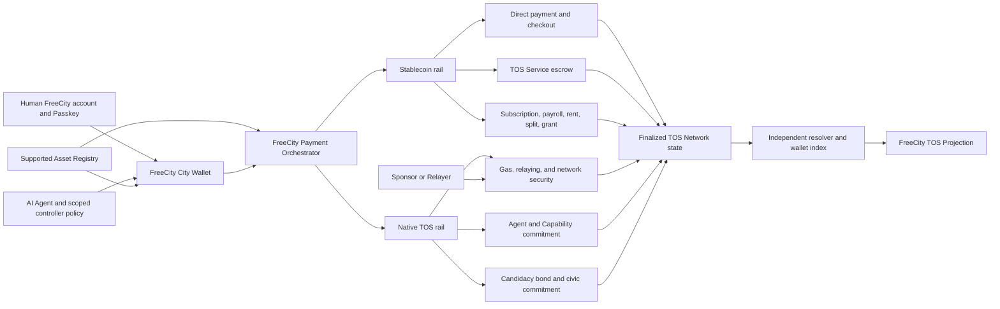

# FreeCity TOS Dual-Currency Infrastructure

**Document version:** 1.1<br>
**Last updated:** 2026-08-16<br>
**Document role:** Audited TOS infrastructure baseline, dual-currency target architecture, implementation sequence, interfaces, readiness gates, and acceptance criteria<br>
**Companion documents:** [FreeCity Vision and Architecture](FREECITY_VISION_AND_ARCHITECTURE.md), [FreeCity Living Economy and Civic Governance](FREECITY_LIVING_ECONOMY_AND_CIVIC_GOVERNANCE.md), [FreeCity Playable Experience V1](FREECITY_PLAYABLE_EXPERIENCE_V1.md), [District Simulation Runtime](FREECITY_DISTRICT_SIMULATION_RUNTIME.md), and [District Zero First Cohort Playbook](FREECITY_DISTRICT_ZERO_FIRST_COHORT_PLAYBOOK.md)<br>
**Normative protocol reference:** [TOS Service specification](https://github.com/tosnetwork/tos-service-spec) and its [FreeCity Application Profile](https://github.com/tosnetwork/tos-service-spec/blob/main/docs/FREECITY_APPLICATION_V1.md)

## Status and Evidence Rule

This document is an implementation reference and an audit snapshot, not evidence that FreeCity payments are deployed. It separates four evidence classes:

| Label | Meaning |
| --- | --- |
| **Implemented** | Relevant code or contract exists in the audited repository snapshot and its repository tests pass where a runnable suite is available |
| **Integration pending** | A lower-level primitive exists, but FreeCity has not yet integrated and accepted it end to end |
| **Production dependency pending** | A required issuer, deployment, audit, operating policy, current-domain proof, or external acceptance is missing |
| **Product target** | The behavior is required by FreeCity but does not yet have an approved complete implementation path |

A design, SDK method, compiled contract, passing unit test, mockup, test token, or historical transaction is not by itself production acceptance.

---

## Executive Decision

TOS Network already provides the essential dual-asset ledger foundation: one owner address can hold native TOS and TOS-network Jetton fungible assets, including a stablecoin. TOS Core also contains Jetton SDK support, wallet-index work, and a stablecoin service-escrow contract. TOS Service adds an exact-asset, fixed-price software-work lifecycle with Quote, escrow, Receipt, release, refund, and independent resolution semantics.

That foundation is necessary but not sufficient for a FreeCity economy. The official mobile wallet V1 surfaces remain native-TOS-only, the current stablecoin is test-only, sponsored stablecoin transfer is reserved rather than production-ready, the service escrow covers only one narrow commercial relationship, and FreeCity has not implemented its wallet, asset registry, payment orchestrator, finality projection, or governance contracts.

The product decision is therefore:

> FreeCity adopts a strict dual-currency model: stablecoin is the understandable unit of account for ordinary life and commerce; native TOS provides network execution, security, bounded commitments, and later civic bonds. Ordinary stablecoin users must not be forced to acquire TOS merely to pay Gas once sponsored transfer is available.

FreeCity must not create an internal balance, city token, alternate escrow, or private settlement ledger to hide the missing product layers.

---

## 1. Dual-Currency Responsibilities

### 1.1 Stablecoin Rail

An exact supported TOS-network stablecoin is the preferred asset for:

- service prices and Agent work;
- creator purchases and patronage;
- subscriptions and managed Agent residence;
- salaries, team revenue shares, and operating budgets;
- rent-like access charges and refundable deposits;
- grants, bounties, and public-project funding; and
- treasury disbursements whose purpose requires a stable unit of account.

Every flow needs a clear payer, recipient, purpose, exact asset identity, amount, authorization rule, finality rule, cancellation or refund rule, and independently resolvable outcome.

### 1.2 Native TOS Rail

Native TOS is used for:

- network execution, contract storage, relaying, and security costs;
- Agent, Capability, or service commitments when a normative contract requires them;
- explicitly voluntary TOS-denominated activity after a reviewed payment primitive exists;
- fixed or capped candidacy bonds after an audited governance contract exists; and
- other long-horizon commitments approved by TOS and FreeCity governance.

TOS holdings do not create verified reputation, votes, office, treasury authority, court authority, enforcement authority, or immunity.

### 1.3 Product Experience Rule

FreeCity presents one **City Wallet** with two visibly distinct balances and roles. It must not silently exchange the assets, combine them into one synthetic balance, or obscure which party pays Gas.

The default commercial experience is:

```text
stablecoin price accepted
  -> resident or Agent signs the commercial intent
  -> approved Sponsor or Relayer attaches native TOS
  -> TOS Network executes the stablecoin transfer or contract action
  -> independent resolver confirms final state
  -> FreeCity projects the result into economic history and the live city
```

Before sponsored transfer is accepted, a controlled public-testnet pilot may pre-fund operator TOS for Gas. The interface must label that arrangement, and it must not be treated as the production design.

---

## 2. Audit Scope and Method

The infrastructure audit reviewed the following repository snapshots on 2026-08-16:

| Repository | Audited revision | Audit focus |
| --- | --- | --- |
| [`tosnetwork/tos`](https://github.com/tosnetwork/tos) | `9079afc807acabb6d4f082bf0f2b69c901af70f0` | Native TOS, Jetton contracts and SDK, wallet index, stablecoin escrow, sponsored-transfer design |
| [`tosnetwork/android`](https://github.com/tosnetwork/android) | `49cae7551cee70217cbd6b3ad36c613271ef8f41` | Official Android wallet product scope |
| [`tosnetwork/ios`](https://github.com/tosnetwork/ios) | `d1b8ac5f00f9588bcb9d6c17648f9c5811ffc1cd` | Official iOS wallet product scope |
| [`tosnetwork/tos-service-spec`](https://github.com/tosnetwork/tos-service-spec) | `f7ef04e17d8865669c2b4f6886812bd10adefa6d` | Normative settlement, escrow, roadmap, and FreeCity profile |
| [`tosnetwork/tos-service-protocol`](https://github.com/tosnetwork/tos-service-protocol) | `39c4ad66eeeac76215f3a74095fe1598d081770e` | Buyer, provider, exact-asset validation, funding, resolution, and RPC implementation |
| [`tosnetwork/tos-service-gateway`](https://github.com/tosnetwork/tos-service-gateway) | `73a69b3cdf2cbe4d7c66c1981b1a3f7848ea3146` | Discovery, Quote proposal, transport authorization, and authority boundary |
| [`tosnetwork/tos-assets`](https://github.com/tosnetwork/tos-assets) | `a05d3423aa24b5f5d4e2f782e62b7c3180510e7d` | Asset metadata or registry availability |

`go test ./...` passed for the audited `tos-service-protocol` and `tos-service-gateway` snapshots. This confirms their repository test suites at those revisions; it does not replace contract audit, live current-domain acceptance, independent operator acceptance, or FreeCity end-to-end validation.

---

## 3. Existing Infrastructure

### 3.1 Accounts and Native TOS

TOS Core provides native accounts, owner-controlled signing, balances, native transfers, contracts, and network fees. The official Android and iOS applications support native TOS wallet creation or import, balance, receive, send, and history.

**Assessment:** implemented lower-level and native-wallet foundation.

### 3.2 Jetton Stablecoin Foundation

TOS implements the Jetton fungible-token model with a Master contract and one derived Jetton Wallet per owner and master, as documented in the [TOS token standards](https://github.com/tosnetwork/tos/blob/main/doc/tos-tep-token-standards.md). The JavaScript contract SDK includes Jetton Master and Wallet wrappers, live balance reads, transfer construction, and burn support. Stablecoin transfer attaches native TOS for execution.

**Assessment:** implemented protocol and SDK foundation; FreeCity integration pending.

### 3.3 Official Wallet Product Scope

The current [Android V1 product matrix](https://github.com/tosnetwork/android/blob/main/docs/android-product-test-matrix.md) and [iOS V1 product matrix](https://github.com/tosnetwork/ios/blob/main/docs/ios-product-test-matrix.md) expose native TOS but defer Jetton, stablecoin, swap, and related token surfaces. Therefore the statement “every address can hold TOS and stablecoin” is true at the chain and asset layer, but it is not yet a complete official-wallet user experience.

**Assessment:** stablecoin wallet product pending.

### 3.4 Wallet Index and Transaction History

TOS Core contains account Jetton, NFT, and event RPC methods plus an off-consensus wallet index writer that verifies Jetton-wallet state against the Master resolver. The [wallet-index document](https://github.com/tosnetwork/tos/blob/main/doc/tos-wc0-wallet-index.md) and implementation status are not yet fully aligned, and the first wallet event schema is stronger for native TOS than interpreted Jetton history.

FreeCity must not infer production availability from code presence. It needs a released endpoint profile, finality behavior, Jetton transfer parsing, pagination and replay rules, load evidence, rebuild evidence, and client acceptance.

**Assessment:** implementation exists; release and product acceptance pending.

### 3.5 TOS Service Stablecoin Lifecycle

TOS Service defines one exact supported stablecoin for machine-checkable software work. The current lifecycle includes:

- finalized Agent and Capability resolution;
- Quote Proposal and Accepted Quote separation;
- exact asset identity and atomic price;
- escrow funding;
- execution admission after policy and funding checks;
- artifact commitment and signed Receipt;
- full release or full refund; and
- independent terminal-state resolution.

The audited protocol implementation validates the exact Master and Wallet code identities and obtains finalized balance evidence. Its current funding sender attaches native TOS, so the buyer still needs Gas unless another approved party funds it.

The authoritative [TOS Service roadmap](https://github.com/tosnetwork/tos-service-spec/blob/main/docs/ROADMAP.md) records current-domain and external acceptance work as pending or incomplete. Existing test and historical evidence must retain those labels. The normative commercial boundary is described in the [settlement specification](https://github.com/tosnetwork/tos-service-spec/blob/main/docs/SETTLEMENT.md) and [stablecoin escrow contract specification](https://github.com/tosnetwork/tos-service-spec/blob/main/docs/STABLECOIN_ESCROW_TVM_V1.md).

**Assessment:** narrow lifecycle substantially implemented; FreeCity, current-domain, and external acceptance pending.

### 3.6 TOS Service Gateway

The Gateway is a stateless public transport and discovery layer. It supports signed Native actions, finalized resolution, Capability search, manifest retrieval, and provider-supplied Quote proposals. Gateway tokens grant transport permissions only; the Gateway does not own canonical business state.

It does not provide a consumer wallet, stablecoin balance API, general payment router, Gas sponsor, accounting ledger, or asset registry. FreeCity must preserve this boundary.

**Assessment:** implemented for its intended discovery and relay scope; not a FreeCity payment backend.

### 3.7 Sponsored Stablecoin Transfer

TOS Core has a [sponsored stablecoin transfer MVP design](https://github.com/tosnetwork/tos/blob/main/doc/sponsored-stablecoin-transfer-mvp.md) for signed transfer intent, Agent policy, sponsored Jetton Wallet, relayer, stablecoin allowlist, budgets, and abuse controls. The design status is reserved or on hold pending the applicable TOS mainnet and review gate.

Without this capability, a stablecoin payer also needs native TOS. That contradicts the intended ordinary-resident experience and is the most important user-experience infrastructure gap.

**Assessment:** production dependency pending.

### 3.8 Asset Registry and Production Stablecoin

The audited `tos-assets` repository contains official brand artwork, not a supported-token registry. TOS Service evidence uses a test-only `tUSDT` identity. FreeCity still needs an approved production stablecoin, issuer and redemption model, exact contract identity, operational status, incident policy, display metadata, and jurisdiction policy.

The existence of a Jetton contract does not prove stable value, reserves, redeemability, issuer authority, or legal availability.

**Assessment:** production dependency pending.

### 3.9 FreeCity Integration

The FreeCity repository currently defines product behavior, architecture, and launch gates. It does not yet contain a deployed City Wallet, payment orchestrator, stablecoin sponsor, chain projection, payment contracts, or candidacy-bond contract.

**Assessment:** product implementation pending.

---

## 4. Readiness Matrix

| Capability | Protocol or code | Product integration | Production evidence | Decision |
| --- | --- | --- | --- | --- |
| Native TOS account and transfer | Implemented | Official wallets available | Network acceptance is outside this document | Reuse |
| Jetton stablecoin ownership and transfer | Implemented foundation | FreeCity and official-wallet UI pending | Production asset pending | Integrate after asset decision |
| Exact stablecoin identity validation | Implemented in TOS Service | FreeCity registry and display pending | Production registry pending | Make mandatory |
| Stablecoin balance and history | SDK and index work exist | Unified City Wallet pending | Release and load acceptance pending | Accept before commerce |
| Software-work escrow | Contract and protocol implementation exist | FreeCity experience pending | Current-domain and external acceptance pending | First economic proof only |
| Direct stablecoin payment | Low-level transfer exists | Intent, receipt, sponsor, refund, and support pending | End-to-end acceptance pending | Build a dedicated primitive |
| Stablecoin Gas sponsorship | Design exists | Not integrated | On hold or pending | P0 for production-quality commerce |
| Tips, subscriptions, payroll, rent, splits, grants | Product concepts only | Pending | Pending | Use purpose-built contracts |
| TOS candidacy bond | Product concept only | Pending | Audit and testnet evidence pending | Implement after economy proof |
| Treasury policy and custody | Product concept only | Pending | Security and institutional acceptance pending | Implement with multisignature and time locks |
| FreeCity TOS projection | Architectural design only | Pending | Rebuild and independent-resolution evidence pending | Build resolver-first |

---

## 5. Target Architecture



### 5.1 Authority Boundaries

| Component | May own | Must not own |
| --- | --- | --- |
| **City Wallet** | Local presentation, signing request, linked-wallet metadata, recovery workflow state | Private settlement balance or silent custody |
| **Supported Asset Registry** | Approved exact asset identities, status, issuer metadata, policy version | User balances or ticker-based asset authority |
| **Payment Orchestrator** | Intent lifecycle, idempotency, route choice, user-readable status, support correlation | Asset custody, finality, or a second transaction history |
| **Sponsor or Relayer** | Bounded Gas policy, relaying, sponsor receipt, abuse controls | Commercial consent or unrestricted wallet authority |
| **TOS Service** | Normative software-work lifecycle and resolver behavior | General consumer commerce or civic semantics |
| **TOS Network** | Asset balances, contract execution, fees, and finalized state | FreeCity social or presentation state |
| **FreeCity TOS Projection** | Rebuildable, provenance-labelled query model | Canonical balance, settlement, or governance authority |

---

## 6. Required Components

### 6.1 Supported Asset Registry

FreeCity needs a versioned, authenticated registry whose entries include:

```text
network_id
master_address
master_code_hash
wallet_code_hash
decimals
symbol and display name
issuer and redemption reference
status: active | deposit_only | paused | retired
minimum confirmations or finality profile
region and product restrictions
risk and incident reference
registry version and effective time
```

The registry may begin as a signed, review-controlled manifest whose digest is anchored or published through an accountable TOS process. A later on-chain registry may replace it. Clients must fail closed for a missing, expired, paused, or mismatched entry.

### 6.2 City Wallet and Identity Binding

The City Wallet must support:

- Passkey-first FreeCity entry without requiring a wallet;
- creation of an owner-controlled wallet or connection of an existing wallet;
- signed challenge binding between a FreeCity actor and a wallet address;
- separate TOS and supported-stablecoin balances;
- receive, send, history, pending, final, failed, and replaced states;
- wrong-network, wrong-asset, token-spam, and phishing protection;
- recovery, device rotation, export or migration, and revocation;
- session keys with asset, amount, recipient, purpose, duration, and frequency limits; and
- distinct Human, Agent, sponsor, controller, and organization authority.

A Human profile is not automatically a TOS Agent, and an Agent controller is not automatically authorized to spend the Human's wallet.

### 6.3 Sponsored Stablecoin Transfer

The minimum signed intent must bind:

```text
intent_id and idempotency_key
network and exact stablecoin identity
payer and recipient
atomic amount
purpose and contract call
nonce and expiry
maximum sponsored TOS cost
controller or wallet policy reference
```

The sponsor must enforce asset, recipient, method, per-action, daily, per-controller, and aggregate limits. It must record submission ambiguity, final transaction reference, actual TOS cost, refusal reason, replay detection, and abuse signals.

Sponsorship pays execution cost; it never signs commercial consent for the payer.

### 6.4 Payment Orchestrator

The FreeCity `PaymentIntent` is an application coordination object, not money. It should bind:

```text
intent_id and idempotency_key
payer, recipient, and accountable initiator
network and exact asset identity
atomic amount and purpose
commercial terms reference
route: direct | service_escrow | subscription | payroll | rent | split | grant | treasury | bond
authorization and sponsor policy
expiry and cancellation or refund policy
```

The orchestrator must:

1. resolve the supported asset and current policy;
2. display a fixed reviewed confirmation;
3. obtain the correct Human, Agent, multisignature, or contract authorization;
4. submit exactly once or resolve ambiguity before retry;
5. follow pending and final chain state;
6. produce a verification reference and accessible support state; and
7. emit a provenance-labelled city event only after the applicable authority transition.

It may not mark a payment successful from a local webhook, model statement, gateway acknowledgement, or transaction broadcast alone.

### 6.5 Purpose-Built Economic Contracts

The existing fixed-price software-work escrow should remain narrow. Additional relationships need explicit semantics:

| Relationship | Minimum additional semantics |
| --- | --- |
| Direct payment or tip | Verified recipient, optional memo, non-refundable warning or explicit refund agreement, sponsor policy |
| Creator checkout | License or access grant, delivery evidence, refund window, platform-fee disclosure |
| Subscription | Period, cap, renewal notice, cancellation, failed renewal, period Receipt |
| Payroll | Schedule, recipient roster, cap, pause, correction, employer approval, payroll Receipt |
| Team split | Precommitted shares, contributor consent, rounding, failed recipient, resolvable distribution |
| Rent or deposit | Access period, deposit custody, damage or breach rule, release, dispute, expiry |
| Grant or bounty | Published criteria, award authority, evidence, conflict disclosure, unused-fund path |
| Treasury | Budget approval, signer policy, time lock, limit, conflict and public audit |

Each primitive requires its own threat model, conformance vectors, resolver, testnet proof, external acceptance, and incident runbook.

### 6.6 Governance Contracts

The first `CandidacyBond` contract must bind:

- office, election, candidate, and accountable controller;
- a fixed or capped TOS amount;
- lock, term, refund, and expiry;
- narrow, objective slashing conditions;
- evidence, challenge, appeal, and final authority;
- unique query and replay protection; and
- independently resolvable state.

Ballot eligibility and ballot weight remain FreeCity civic rules backed by resident credentials. The bond contract must not infer votes or appoint an officeholder. Treasury execution must use a separate multisignature or policy contract with time locks and conflict rules.

### 6.7 Finality, Indexing, and Projection

FreeCity needs a TOS Projection service that:

- queries the approved resolver and more than one validator or independent endpoint where required;
- preserves block, checkpoint, finality, asset, contract, and resolver provenance;
- parses native TOS and supported Jetton transfers;
- exposes pending, final, failed, bounced, released, refunded, and unresolved states;
- supports pagination, replay, rebuild, rollback fences, and idempotent event emission;
- separates authoritative chain facts from partial gateway observation;
- emits WebSocket or SSE updates without becoming authority; and
- can be deleted and rebuilt without changing economic or civic state.

Live balances remain live chain-derived values. A cached balance must expose freshness and must not authorize spending.

The [District Simulation Runtime](FREECITY_DISTRICT_SIMULATION_RUNTIME.md) consumes a payment or protocol transition only through this verified projection and a versioned external-event adapter. The runtime may unlock a gameplay consequence after the applicable finalized event, but it cannot submit economic consent on a resident's behalf, infer finality from a client or room server, alter the TOS lifecycle, or turn a pending animation into settlement.

### 6.8 Security and Operations

Required operational controls include:

- independent smart-contract and wallet security review;
- relayer key separation and limited sponsor wallets;
- spend caps, rate limits, anomaly detection, and emergency pause;
- token-spam and deceptive-asset filtering;
- high-value and unusual-recipient confirmation;
- wallet recovery, sponsor outage, index lag, stuck transaction, and chain-reorganization runbooks;
- reconciliation for every submitted intent;
- metrics for success, latency, duplicate prevention, sponsor cost, refunds, disputes, unsupported assets, and recovery; and
- public evidence packages for each readiness gate.

Legal, tax, sanctions, consumer-protection, custody, stablecoin-issuer, and operating-jurisdiction decisions remain required before lawful production use. Licensed external providers may provide regional on-ramps or off-ramps, but FreeCity settlement remains the supported TOS-network asset.

---

## 7. Implementation Sequence

### Phase 0: Freeze the Authority Boundary

- approve the dual-currency responsibility table;
- select one testnet stablecoin identity and define the production selection process;
- publish the first signed Supported Asset Registry manifest;
- freeze `PaymentIntent`, sponsored-transfer intent, receipt, and projection schemas;
- define Human, wallet, Agent, controller, sponsor, and organization binding;
- record exact resolver, finality, and index dependencies; and
- prohibit internal balance and ticker-only asset routing in code review.

### Phase 1: District Zero Read-Only Wallet and One Economic Proof

- implement Passkey entry and optional signed wallet linking;
- show native TOS and one exact testnet stablecoin balance with provenance;
- show receive address, transaction history, pending state, and finality;
- integrate one machine-checkable software-work lifecycle;
- let the operator fund testnet Gas under a disclosed bounded policy;
- project Quote, funding, execution, Receipt, release, refund, and error states into accessible history and the live city; and
- run the ten-person compressed dry run before external invitation.

No tip, subscription, payroll, rent, treasury, or candidacy-bond flow is enabled in this phase.

### Phase 2: Dual-Currency Commerce Pilot

- complete and accept sponsored stablecoin transfer under the applicable TOS release gate;
- make a stablecoin-only payer able to complete an ordinary payment without acquiring TOS;
- integrate the Supported Asset Registry into every wallet and payment surface;
- release stablecoin balance, receive, send, and history across the selected Web and mobile clients;
- implement direct stablecoin `PaymentIntent`, receipt, idempotency, support, and reconciliation;
- enable one reviewed creator-checkout or patronage primitive; and
- complete public-testnet, external-operator, security, recovery, and load acceptance.

### Phase 3: Living Economy

- implement subscriptions and managed Agent residence;
- implement payroll, team split, rent or deposit, grants, and organization budgets one primitive at a time;
- add treasury policies, accounting export, fee disclosure, and applicable tax records;
- add bounded Agent spending with revocable session policies; and
- require repeated paid outcomes, acceptable disputes, and recovery evidence before expanding limits.

### Phase 4: Civic Commitments

- deploy and audit the fixed or capped candidacy-bond contract;
- implement treasury multisignature, time lock, spend limits, and public projection;
- integrate privacy-preserving resident ballots without TOS-weighted authority;
- rehearse whales, Sybils, Agent fleets, bribery, capture, key loss, appeal, and recovery; and
- grant consequential office power only after successful bounded district evidence.

---

## 8. Acceptance Gates

### 8.1 Dual-Currency Product Gate

- [ ] a resident can enter and experience value without creating a wallet;
- [ ] a resident can create or link an owner-controlled wallet through a signed binding;
- [ ] the City Wallet displays native TOS and an exact supported stablecoin separately;
- [ ] every supported stablecoin entry matches the active registry identity and code hashes;
- [ ] a stablecoin-only payer can complete an approved ordinary payment without acquiring TOS;
- [ ] the interface names the commercial price, network cost, and actual Gas payer separately;
- [ ] no automatic or silent asset exchange occurs;
- [ ] unsupported, paused, wrong-network, or deceptive assets fail closed; and
- [ ] FreeCity has no private monetary balance or alternate settlement history.

### 8.2 Payment Correctness Gate

- [ ] retry, refresh, timeout, and ambiguous broadcast cannot create a duplicate charge;
- [ ] every intent has an idempotency key, expiry, accountable initiator, and exact asset;
- [ ] broadcast acknowledgement is not displayed as final settlement;
- [ ] an independent resolver reproduces every terminal payment state;
- [ ] release and refund are mutually exclusive and visibly distinct from pending requests;
- [ ] support can locate the intent, signature, sponsor action, transaction, finality, and city event;
- [ ] the projection can be deleted and rebuilt from durable sources; and
- [ ] wallet, relayer, index, and contract failure paths have tested recovery.

### 8.3 Agent Authority Gate

- [ ] an Agent cannot spend outside its approved asset, amount, recipient, purpose, period, or aggregate limit;
- [ ] controller, sponsor, runtime, and signer remain distinguishable;
- [ ] revocation prevents new submissions and leaves an auditable history;
- [ ] a generated interface cannot bypass the fixed payment confirmation; and
- [ ] commercial consent and Gas sponsorship require separate authorities.

### 8.4 Production Evidence Gate

- [ ] the stablecoin issuer, reserves or backing model, redemption, administration, incidents, and applicable jurisdictions are approved;
- [ ] contract, wallet, relayer, and critical projection components complete security review;
- [ ] current-domain live evidence is reproduced through independently operated endpoints;
- [ ] external buyer and provider sessions complete release and refund paths;
- [ ] sponsor cost, success, latency, abuse, reconciliation, and recovery meet published limits;
- [ ] user testing confirms residents understand stablecoin price, TOS cost, sponsorship, pending, final, and refund; and
- [ ] all public claims use the evidence label actually achieved.

---

## 9. Non-Negotiable Invariants

1. Stablecoin is the default unit of account for ordinary FreeCity commerce; native TOS is not a second mandatory purchase for that commerce once sponsorship is accepted.
2. Native TOS remains the actual TOS Network execution and security asset even when a Sponsor pays it invisibly on the resident's behalf.
3. Every supported stablecoin is identified by exact network and contract identity, never by ticker alone.
4. Commercial consent, wallet signing, Gas sponsorship, contract execution, finality, and city projection remain separate states and authorities.
5. FreeCity stores application intents and rebuildable projections, not canonical balances or settlement authority.
6. The TOS Service fixed-price software-work escrow is not reused for unrelated consumer or civic relationships.
7. Human, Agent, controller, sponsor, organization, and wallet identities remain distinguishable.
8. TOS commitment does not create civic authorization; holdings cannot buy votes or office.
9. A payment-like interface remains disabled when its exact contract, resolver, recovery, and acceptance path is unavailable.
10. Test tokens, testnet transfers, repository tests, and design documents never become production or willingness-to-pay evidence.

---

## 10. Design Consistency Review

The audited target is consistent with the wider FreeCity design for the following reasons:

- **Value before wallet remains intact.** The City Wallet appears only when a resident chooses an economic action.
- **There is no shadow bank.** TOS Network remains the authority for balances, assets, contracts, and settlement.
- **The two assets have legible jobs.** Stablecoin provides understandable prices; TOS provides execution, security, and bounded commitment.
- **Agent autonomy remains bounded.** An Agent receives a scoped spending policy rather than ambient wallet control.
- **The live city remains truthful.** Economic animations derive from provenance-labelled intent, pending, or finalized states and never fabricate commerce.
- **Governance remains non-plutocratic.** A fixed or capped TOS bond can prove commitment, while resident credentials and ballots grant authority.
- **The first cohort remains implementable.** District Zero may validate one testnet software-work flow without pretending the complete economy is ready.

The review also changes five earlier assumptions into explicit implementation rules:

1. a wallet address that can hold a Jetton is not evidence of a stablecoin-ready wallet product;
2. `tos-assets` is not a supported-token registry;
3. TOS Service Gateway is not a payment gateway or canonical balance source;
4. the current service escrow is not a universal commerce contract; and
5. Gas sponsorship is a production prerequisite for the intended stablecoin-only resident experience, not an optional polish item.

---

## 11. Definition of Done

FreeCity may describe its dual-currency infrastructure as **implemented** only when:

1. the Supported Asset Registry, City Wallet, Payment Orchestrator, Sponsor or Relayer, resolver, wallet index, and TOS Projection pass their acceptance gates;
2. one supported production stablecoin has an approved issuer and operational policy;
3. a stablecoin-only resident completes a real approved payment without acquiring TOS;
4. every state is independently resolvable and retry-safe;
5. wallet and sponsor recovery are tested;
6. FreeCity contains no private settlement balance;
7. public claims accurately distinguish testnet, pilot, current-domain, external, and production evidence; and
8. the applicable security, legal, operational, and jurisdiction gates pass.

Until then, the correct status is **dual-currency architecture defined; implementation and production acceptance pending**.

---

## 12. Review Conclusion

TOS Network already supplies enough foundation to justify the FreeCity dual-currency architecture. Reusing native TOS accounts, Jetton assets, finalized chain state, and the TOS Service software-work lifecycle is substantially safer and more coherent than inventing a FreeCity token or internal balance.

The highest-priority work is not another wallet primitive. It is the missing product and authority layer between chain capability and resident experience:

1. approve a production-quality stablecoin and exact Supported Asset Registry;
2. complete sponsored stablecoin transfer so ordinary commerce does not require residents to acquire TOS;
3. build the City Wallet, Payment Orchestrator, and resolver-first TOS Projection; and
4. add each economic and civic relationship through a purpose-built, reviewed contract rather than extending the service escrow by analogy.

That sequence turns “one wallet can store two assets” into a trustworthy living economy where stablecoin is usable money, TOS is network and commitment infrastructure, and neither asset becomes a shortcut around consent, safety, or civic legitimacy.
